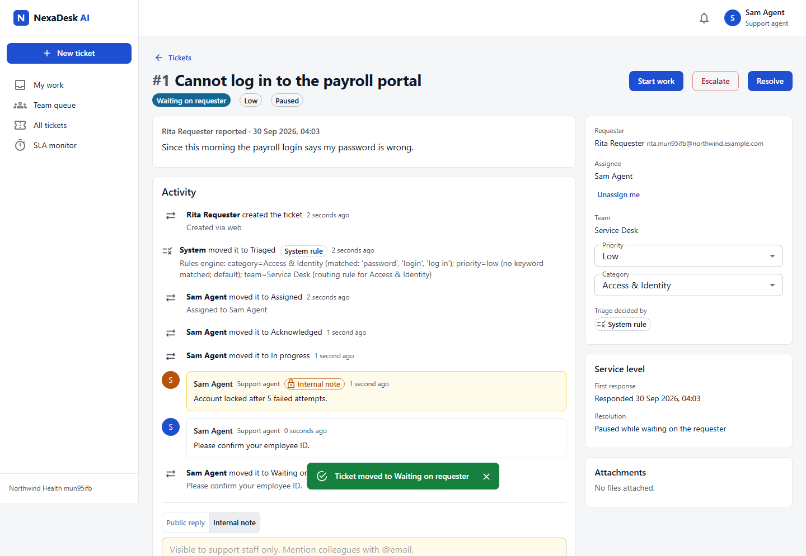
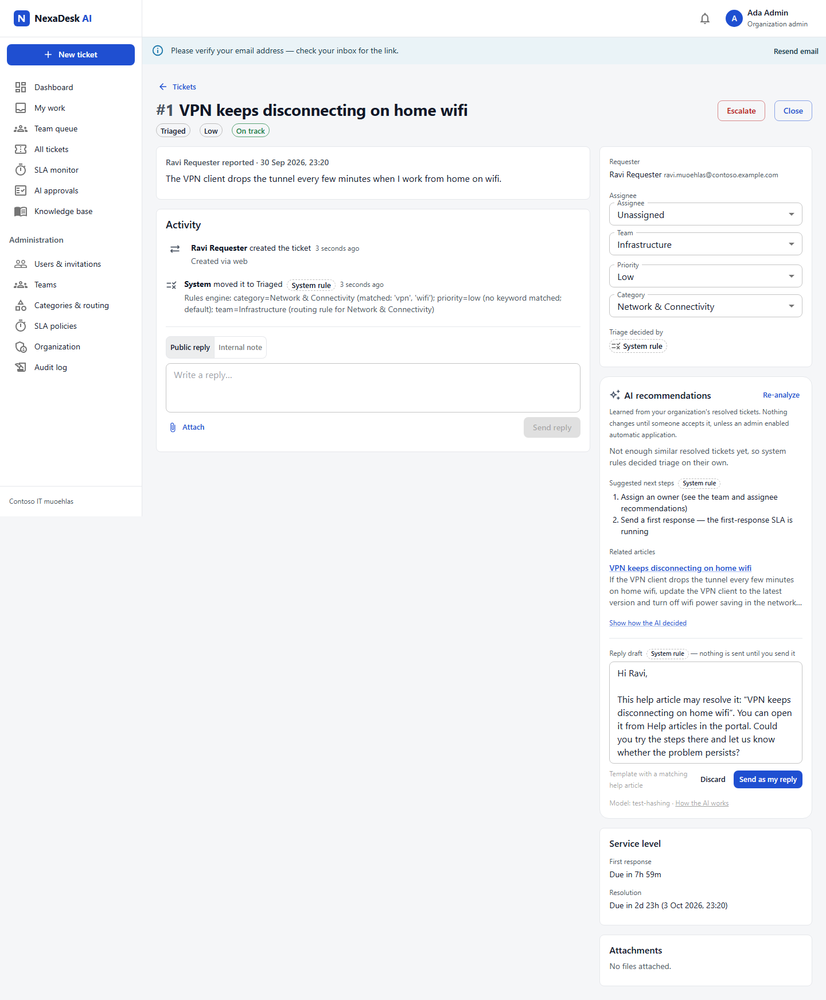
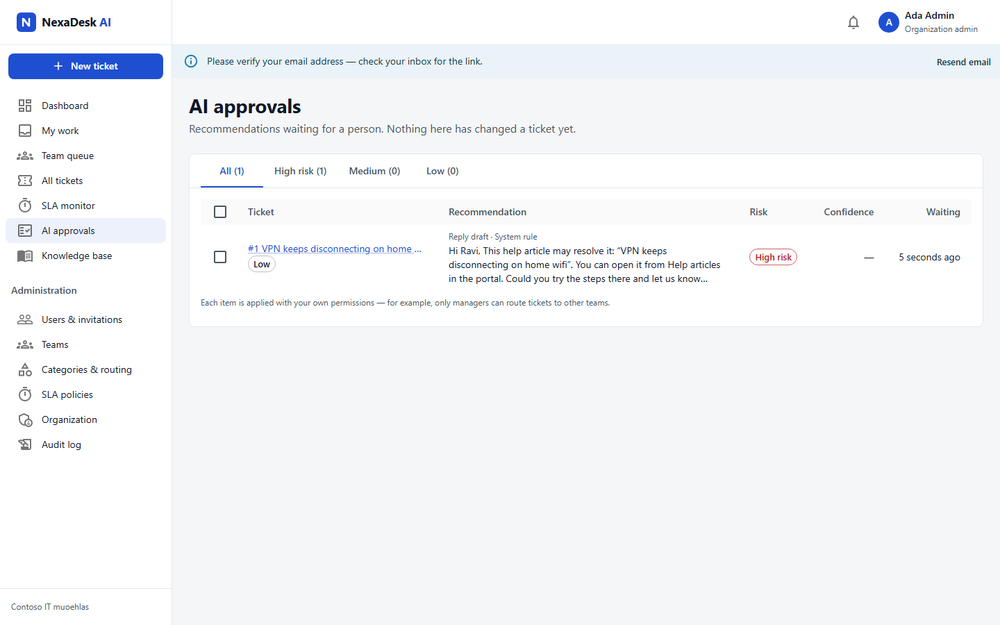
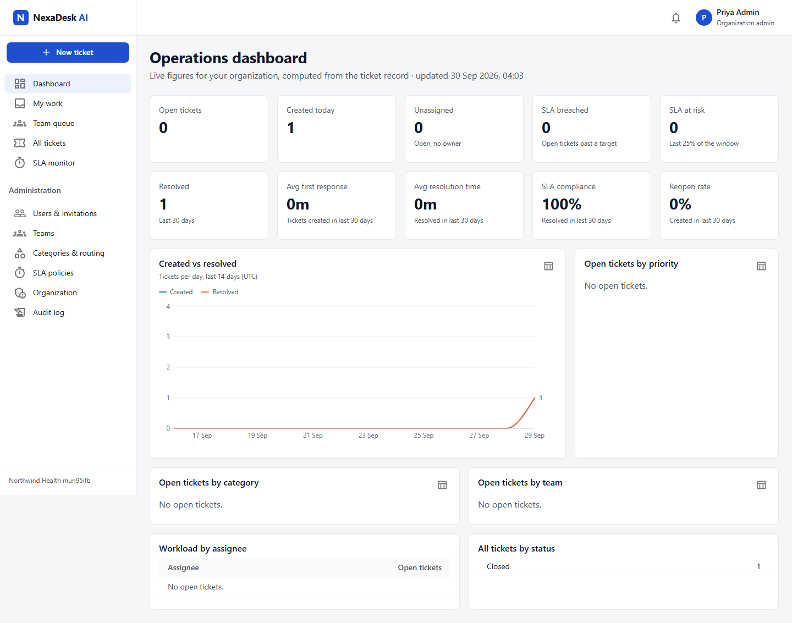
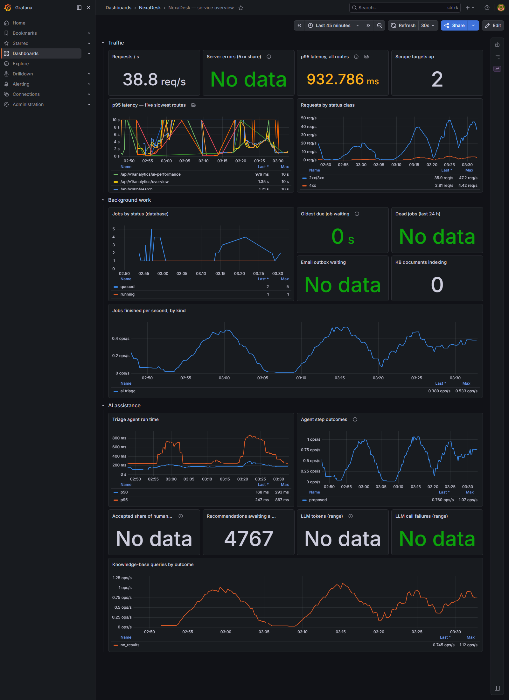
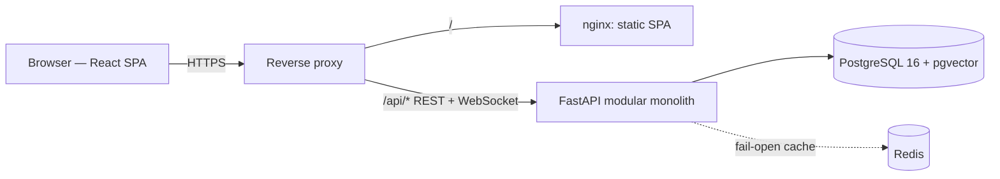

# NexaDesk AI — Enterprise AI Service Management Platform

> **Status: public demo deployment (free tier); no real users yet.** Core workflow, AI-assisted
> triage, knowledge base, triage agent with human approval, observability, security controls and
> CI gates are implemented and measured on public benchmarks, synthetic replays, a local load
> test and checks against the live demo. Generated-answer quality and real-user outcomes are not
> measured yet. Every number below says which kind of evidence it is.
>
> **Live demo:** web <https://nexadesk-api.netlify.app> · API <https://nexadesk-api-qp6v.onrender.com>
> (OpenAPI at `/api/docs`). Free tier: the API sleeps when idle and needs 2–3 minutes to wake up;
> the web app says so while it waits. Demo organizations and tickets are illustrative data.

## The business problem

Internal service desks (IT, HR, facilities) receive requests by email, chat, forms and
hallway conversations. Tickets are categorized and assigned by hand, often to the wrong team;
SLA commitments are tracked in people's heads; duplicates pile up; requesters chase for updates;
and managers can't see backlog or performance until something breaches.

## The solution

NexaDesk AI gives every request one structured, auditable record and moves it through an
enforced workflow:

**intake → triage (category, priority, team) → assignment → work → resolution → requester confirmation → closure**

with SLA clocks that pause while waiting on the requester, automatic escalation on breach, and
live operational analytics. Automation is layered deliberately: deterministic **system rules**
first (built — the measured baseline and permanent fallback), then **trained models and
retrieval-augmented assistance** (P4–P7), always behind **human approval for high-impact
actions** (P8). Every automated decision is labelled as a *system rule*, *AI recommendation* or
*human decision*, and every change is in the audit log.



## What works today

| Capability | Details |
|---|---|
| Multi-tenant SaaS | Self-service organization sign-up; requester portal (opt-in, email-domain restricted); invitations; six roles (platform admin, org admin, manager, agent, requester, read-only analyst) |
| Ticket lifecycle | `submitted → triaged → assigned → acknowledged → in_progress ⇄ waiting_for_customer → resolved → closed`, plus `escalated` and `reopened`; transitions validated per role; full status history |
| Triage & routing | Deterministic rules engine (per-org keywords, whole-word matching, explanation of every decision) + category→team routing table + optional least-loaded auto-assignment |
| SLA management | Per-priority first-response and resolution targets; pause while waiting on the requester; breach recording; auto-escalation; auto-close |
| Collaboration | Public replies, internal notes, @mentions, validated attachments, live WebSocket notifications |
| Oversight | Append-only audit log with request ids; operations dashboard computed live from the ticket record; demo data always labelled |
| Security | Rotating refresh tokens with reuse detection, hashed single-use email tokens, rate limits, strict CSP, upload validation, production config guard — see [security architecture](docs/system_design.md#10-security-architecture-implemented-hardened-further-in-p14) |
| AI-assisted operations | Per-organization recommendations for category, priority, team, assignee and possible duplicates from the org's own resolved tickets, with confidence and the similar tickets behind them; SLA-risk and resolution-time statistics; accept / edit / reject; optional auto-apply above a confidence threshold for low-risk fields only |
| Knowledge base | PDF/DOCX/Markdown/HTML upload, published vs internal articles, search, article suggestions while a requester writes a ticket, related articles for agents; cited answers when a text-generation provider is enabled |
| Triage agent + approvals | Typed tools with validation, risk levels, verification and rollback; every high-risk action (replies, requests for details, escalation, duplicate links) waits in an approval queue |
| Operations | Prometheus metrics, Grafana dashboard and alert rules, daily AI drift checks, model-promotion regression gate, pilot/CSAT/feedback reporting |

| AI recommendations on a ticket | Approval queue |
|---|---|
|  |  |

| Operations dashboard | Grafana during the load test |
|---|---|
|  |  |

*App screenshots are captured by the Playwright end-to-end tests (test data, deterministic test
embedder); the Grafana screenshot shows the local load test's synthetic traffic.*

## Architecture



Modular monolith by design (ADR-1): one deployable, cross-module transactions (a ticket change,
its history row, audit entry and notifications commit atomically). Full design, ADRs and
diagrams: [`docs/system_design.md`](docs/system_design.md). Baseline audit of the project this
grew from: [`docs/current_architecture.md`](docs/current_architecture.md).

## Technology stack

| Layer | Technology |
|---|---|
| API | Python 3.12, FastAPI, SQLAlchemy 2 (typed), Pydantic 2, Alembic, PyJWT, bcrypt |
| Data | PostgreSQL 16 + pgvector (HNSW) + full-text + pg_trgm, Redis |
| Web | React 19, TypeScript, MUI 7, TanStack Query, React Router 7, Recharts, Vite |
| Quality | pytest (SQLite + PostgreSQL), Vitest + Testing Library, Playwright, ruff, mypy, ESLint, pip-audit, npm audit |
| AI | FastEmbed (ONNX) all-MiniLM-L6-v2, kNN over each org's history; offline: scikit-learn, LightGBM, sentence-transformers |
| Operations | Prometheus, Grafana, Locust, Bandit, gitleaks |
| Delivery | Docker (non-root images), Docker Compose, Caddy, GitHub Actions |

## Measured results (evidence type in brackets)

| What | Result | Source |
|---|---|---|
| Ticket classification [public benchmark] | TF-IDF + LinearSVC macro-F1 0.676 queue · 0.892 type · 0.689 priority (majority 0.045 / 0.144 / 0.189) | `reports/classification/` |
| Routing [real ServiceNow log] | model top-1 0.655, top-3 0.857 vs dispatcher's first assignment 0.673; at confidence ≥ 0.9: 16% of incidents at 0.937 (dispatcher 0.928 on the same) | `reports/routing/` |
| Duplicate detection [real forum duplicates] | Recall@10 0.532; production flag threshold 0.75 → precision 0.47, recall 0.18 | `reports/duplicates/` |
| SLA breach [real log] | ROC-AUC 0.769; recalibration fixes base-rate drift (Brier 0.190 → 0.151) | `reports/sla/` |
| Knowledge retrieval [public benchmark] | dense nDCG@10 0.407 vs equal-weight hybrid 0.372 → ships dense-first with full-text fallback | `reports/rag/` |
| Shipped pipeline [synthetic replay, 2,400 tickets] | category accuracy 0.46–0.53 vs majority 0.28–0.31; 0.90–0.97 accuracy on the 6–10% with confidence ≥ 0.7; agent run p50 107–314 ms | `reports/pipeline/` |
| Agent ablation [synthetic replay] | no gate: 47–54% of automatic changes wrong; default gate 0.9: 5–6% automated, 0 of 133 wrong, rest to people | `reports/pipeline/agent_ablation.md` |
| Vector index [synthetic replay] | pgvector defaults returned as few as 14/60 rows for a tenant (recall 0.41); NexaDesk settings 60/60, recall ≥ 0.99 | `reports/pipeline/` |
| Load [local laptop, 100k synthetic tickets] | 100 users: ~30 req/s, p95 150 ms, 0 errors; 250 users: ~66 req/s, 0 errors; saturates ~65–70 req/s; ≈ 1.2 GiB memory. Found and fixed a connection-pool deadlock | `reports/load/README.md` |
| Free-tier fit [local simulation: 512 MB, no swap, 0.1 CPU] | default settings OOM-killed on a large KB document; with 1 embedding thread, batch 4 and `MALLOC_ARENA_MAX=2` memory levelled off at ~360 MB (peaks ≤ 412 MB) under repeated search + triage; restart 6 min → 146–161 s after start-up fixes | `reports/render_free_tier.md` |
| Live demo [Render free API + Neon, probed from one client, 2026-10-01] | warm: health/me/tickets/KB search p50 0.31–0.36 s, login 2.0 s (bcrypt), ticket create 0.56 s; sign-up, login, session refresh and notification WebSocket verified in a browser | `reports/render_free_tier.md` |
| Tests | backend 385 (SQLite and PostgreSQL 16 + pgvector, 91% coverage), frontend 34, Playwright 3 flows, Bandit/gitleaks reviewed | CI, `docs/execution_plan.md` |
| Real users, business impact, generated-answer quality | **not measured yet** | `docs/pilot_plan.md`, `docs/business_value.md` |

## Further documentation

- [Benchmark results and gaps](reports/final_benchmark.md)
- [Architecture diagrams](docs/architecture_diagrams.md)
- [External deployment and pilot checklist](docs/external_setup_checklist.md)
- [Business case](docs/business_case.md) and [transformation roadmap](docs/transformation_roadmap.md)
- [Interview guide](docs/interview_guide.md)
- [Dataset provenance](docs/datasets.md), [AI evaluation](docs/ai_evaluation.md), and [failure analysis](reports/error_analysis.md)

## Run it locally

```bash
docker compose up --build                                    # http://localhost:3000
docker compose exec backend python -m app.scripts.seed_demo  # optional demo organizations
```

Without Docker, see [`docs/runbook.md`](docs/runbook.md). API reference: `http://localhost:8000/api/docs`.

## Deployment

**Live (free tier):** API on Render (Docker, 512 MB / 0.1 CPU, AI on with measured settings),
PostgreSQL on Neon, SPA on Netlify proxying `/api` to the API — zero hosting cost; set up with
[`render.yaml`](render.yaml) and [`netlify.toml`](netlify.toml), steps in
[`docs/deployment.md`](docs/deployment.md#render-free-tier--zero-cost-public-demo).

**Production target:** single VM with Docker Compose: Caddy (automatic HTTPS) → web + FastAPI
(2 processes) + worker, PostgreSQL, Redis. CI builds images tagged with the commit SHA; `deploy.sh` backs up, migrates
once, starts, smoke-tests and **rolls back automatically** on failure. Rehearsed locally,
including a deliberately broken release — see [`docs/deployment.md`](docs/deployment.md). Until
real external users exist the URL is a *public demo deployment*, not production adoption.

## Limitations (honest, current)

* AI recommendations and retrieval are implemented; generated-answer quality is not benchmarked and external text generation remains opt-in.
* The live demo runs on free tiers: the API sleeps when idle (2–3 min wake-up), has 0.1 CPU, no
  Redis or separate worker, and loses ticket attachments on restart. The VM deployment (Caddy,
  worker, Redis, backups, CD) is rehearsed locally but not live.
* Email delivery requires SMTP configuration; without it, emails stay in the outbox table.
* Load and scale were measured on a laptop, not on the target VM; re-run `loadtest/` there.
* A pre-rewrite JWT default key exists in public git history; it is unused and must be treated as
  public (see `docs/security.md`).

## Roadmap

P0–P18 are implemented and measured where measurement is possible without users. Outstanding:
external go-live (P2: owner's VM, DNS, secrets), the real-user pilot and its business evidence
(P9/P16), and generated-answer evaluation once a text-generation provider is approved. See
[`docs/transformation_roadmap.md`](docs/transformation_roadmap.md) and
[`docs/execution_plan.md`](docs/execution_plan.md).
