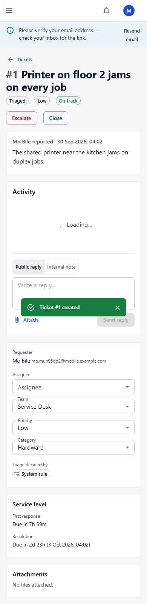
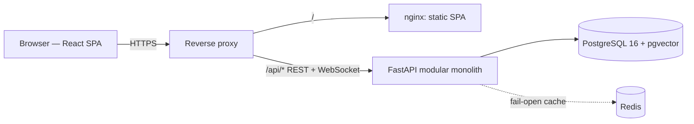

# NexaDesk AI — Enterprise AI Service Management Platform

> **Project status: Priority 1 of 18 complete.** The multi-tenant service-management core is
> built and tested end to end. AI models, the public deployment and all performance/quality
> benchmarks are later stages — no model-quality, performance or business-impact numbers are
> claimed below until the experiment that produced them is in this repository.
> Roadmap and stage reports: [`docs/execution_plan.md`](docs/execution_plan.md).

## The business problem

Internal service desks (IT, HR, facilities) receive requests by email, chat, forms and
hallway conversations. Tickets are categorized and assigned by hand, often to the wrong team;
SLA commitments are tracked in people's heads; duplicates pile up; requesters chase for updates;
and managers can't see backlog or performance until something breaches.

## The solution

NexaDesk AI gives every request one structured, auditable record and moves it through an
enforced workflow:

**intake → triage (category, priority, team) → assignment → work → resolution → requester confirmation → closure**

with SLA clocks that pause while waiting on the requester, automatic escalation on breach, and
live operational analytics. Automation is layered deliberately: deterministic **system rules**
first (built — the measured baseline and permanent fallback), then **trained models and
retrieval-augmented assistance** (P4–P7), always behind **human approval for high-impact
actions** (P8). Every automated decision is labelled as a *system rule*, *AI recommendation* or
*human decision*, and every change is in the audit log.


## What works today (Priority 1)

| Capability | Details |
|---|---|
| Multi-tenant SaaS | Self-service organization sign-up; requester portal (opt-in, email-domain restricted); invitations; six roles (platform admin, org admin, manager, agent, requester, read-only analyst) |
| Ticket lifecycle | `submitted → triaged → assigned → acknowledged → in_progress ⇄ waiting_for_customer → resolved → closed`, plus `escalated` and `reopened`; transitions validated per role; full status history |
| Triage & routing | Deterministic rules engine (per-org keywords, whole-word matching, explanation of every decision) + category→team routing table + optional least-loaded auto-assignment |
| SLA management | Per-priority first-response and resolution targets; pause while waiting on the requester; breach recording; auto-escalation; auto-close |
| Collaboration | Public replies, internal notes, @mentions, validated attachments, live WebSocket notifications |
| Oversight | Append-only audit log with request ids; operations dashboard computed live from the ticket record; demo data always labelled |
| Security | Rotating refresh tokens with reuse detection, hashed single-use email tokens, rate limits, strict CSP, upload validation, production config guard — see [security architecture](docs/system_design.md#10-security-architecture-implemented-hardened-further-in-p14) |

| Operations dashboard | Mobile |
|---|---|
|  |  |

*Screenshots are captured by the Playwright end-to-end test; the data in them is test data.*

## Architecture



Modular monolith by design (ADR-1): one deployable, cross-module transactions (a ticket change,
its history row, audit entry and notifications commit atomically). Full design, ADRs and
diagrams: [`docs/system_design.md`](docs/system_design.md). Baseline audit of the project this
grew from: [`docs/current_architecture.md`](docs/current_architecture.md).

## Technology stack

| Layer | Technology |
|---|---|
| API | Python 3.12, FastAPI, SQLAlchemy 2 (typed), Pydantic 2, Alembic, PyJWT, bcrypt |
| Data | PostgreSQL 16 (+pgvector, used from P4), Redis |
| Web | React 19, TypeScript, MUI 7, TanStack Query, React Router 7, Recharts, Vite |
| Quality | pytest (SQLite + PostgreSQL), Vitest + Testing Library, Playwright, ruff, mypy, ESLint, pip-audit, npm audit |
| Delivery | Docker (non-root images), Docker Compose, GitHub Actions |

## Verified quality (measured, reproducible)

| Check | Result | How to reproduce |
|---|---|---|
| Backend tests | 253 passing on SQLite **and** PostgreSQL 16; 94% line coverage | `cd backend && pytest --cov` |
| Tenant isolation | Every org-scoped endpoint probed with foreign-org tokens → 404 | `tests/test_tenant_isolation.py` |
| Baseline-audit defects A1–A10 | Each has a regression test | `tests/test_security.py` |
| End-to-end | Full acceptance workflow through the UI across three browser sessions; mobile flow with no horizontal scroll | `cd frontend && npx playwright test` |
| Frontend | 24 unit tests; ESLint and TypeScript clean | `npm test` |
| Types | mypy clean on `app/` | `mypy app` |
| Dependencies | `pip-audit` and `npm audit`: no known vulnerabilities at the time of the P1 commit | CI `dependency-audit` job |

Performance, load, model-quality and business-impact results: **not yet measured** (P4, P6,
P10–P11, P16). They will appear here only with the script and raw output that produced them.

## Run it locally

```bash
docker compose up --build                                    # http://localhost:3000
docker compose exec backend python -m app.scripts.seed_demo  # optional demo organizations
```

Without Docker, see [`docs/runbook.md`](docs/runbook.md). API reference: `http://localhost:8000/api/docs`.

## Deployment

Public demo deployment is Priority 2 (single VM, Docker Compose, Caddy auto-HTTPS). Until real
external users exist it is described as a *public demo deployment*, not production adoption.

## Limitations (honest, current)

* No machine-learning models yet — triage is the rules engine, and is labelled as such.
* Background work (SLA sweep, email delivery) runs in the API process; moves to a worker in P2.
* WebSocket fan-out and rate-limit counters are per process (single-instance) until moved to Redis.
* Email delivery requires SMTP configuration; in development emails are read from the outbox.
* No load or performance testing yet.

## Roadmap

P2 deployment · P3 datasets · P4 baseline ML · P5 AI-assisted operations · P6 RAG · P7 agent ·
P8 human-in-the-loop · P9 pilot · P10–P11 load & scale · P12–P13 observability & model
monitoring · P14 security · P15 CI/CD gates · P16 business value · P17 cost · P18 polish.
Details: [`docs/execution_plan.md`](docs/execution_plan.md).
