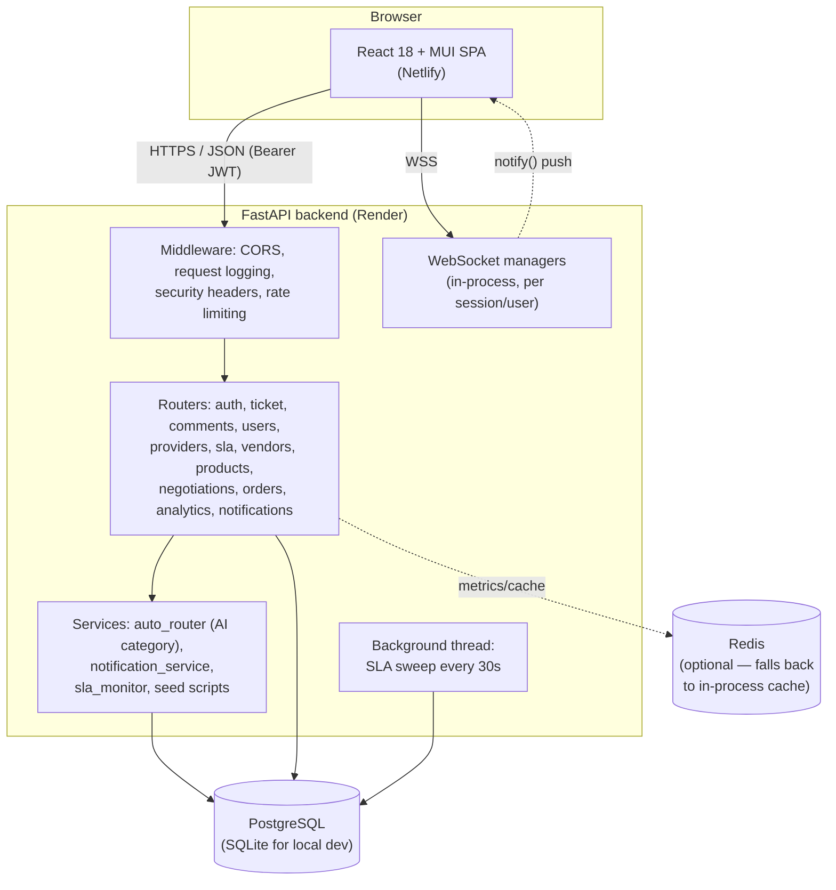
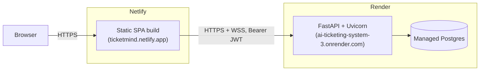

# High-Level Design — AI Ticketing System & Marketplace

## 1. What this system is

A multi-tenant web platform with two product surfaces sharing one auth/user model:

- **Ticketing** — customers file support tickets, AI classifies category/priority, providers
  pick them up, prices are bargained per-ticket, an SLA monitor auto-escalates late tickets.
- **Marketplace** — vendors (any number per category) list products, customers negotiate price
  directly with the vendor over a live WebSocket chat (numbers and accept/decline only, no
  automated counterparty), then check out into orders.

Both surfaces share: tenants, users/roles, JWT auth, and a real-time notification feed.

## 2. Component diagram

## 3. Deployment topology

- **Frontend**: Create React App, built as a static bundle, deployed to Netlify. No server-side
  rendering; all data comes from the backend API.
- **Backend**: single Uvicorn process on Render (one dyno/instance). WebSocket connection
  managers are **in-process memory** — this only works correctly with a single backend
  instance. Scaling to multiple instances would require moving connection fan-out to a shared
  pub/sub layer (Redis), noted as a deferred concern in `negotiation_ws.py` / `notification_ws.py`.
- **Database**: Postgres in production, SQLite for local dev (see `init_db.py`'s SQLite-only
  auto-patch shims, which keep a local dev DB schema in sync without requiring `alembic upgrade
  head` on every pull).
- **Render does not auto-deploy from GitHub pushes for this service** — every deploy requires a
  manual "Manual Deploy → Deploy latest commit" click in the Render dashboard.

## 4. Multi-tenancy

Every domain table carries a `tenant_id` foreign key. Every query that lists or mutates
tenant-owned data filters by `current_user.tenant_id` (never trusts a tenant ID from the
request body/path without cross-checking it against the authenticated user). There is currently
one tenant seeded by default; the schema supports more without code changes.

## 5. AuthN/AuthZ

- Passwords hashed with bcrypt (`passlib`).
- JWT (HS256) bearer tokens, configurable expiry (`ACCESS_TOKEN_EXPIRE_MINUTES`).
- Role stored on `User.role`: `admin`, `customer`, `provider`/`service_provider`, `vendor`.
- Role checks are done per-endpoint (`require_role()` / inline `if current_user.role != ...`),
  not via a central policy table — acceptable at this scale, but means role logic is scattered
  across routers (see LLD "Known limitations").

## 6. The two negotiation systems

There are **two independent bargaining systems** that look similar but are not shared code.
Both are strictly human-to-human — no automated counterparty on either side, only numbers and
accept/decline ever appear in either chat:

| | Ticket bargaining | Marketplace negotiation |
|---|---|---|
| Table | `price_negotiations` | `negotiation_sessions` + `negotiation_messages` |
| Transport | HTTP POST per offer | WebSocket, live push |
| Counterparty | Human provider | Human vendor |
| Where | `routers/ticket.py` bargaining endpoints | `routers/negotiations.py` |

This duplication is intentional-by-history rather than by design — the ticket bargaining flow
shipped first, the marketplace negotiation flow was built later with WebSocket support and
never backported. Documented here rather than merged, since merging would be a real refactor
with its own risk, not a "make it production ready" fix.

## 7. Cross-cutting concerns

- **Structured logging**: `app/core/logging.py` configures JSON log lines; the request-logging
  middleware logs method/path/status/duration for every request; the global exception handler
  (`main.py`) logs full context for anything uncaught and returns a generic 500 body instead of
  leaking a stack trace.
- **Rate limiting**: `slowapi`, applied per-endpoint (auth endpoints are the tightest).
- **CORS**: origin allowlist via `CORS_ORIGINS` env var; falls back to `*` only when unset,
  which is safe here because auth is a Bearer token (not a cookie), so wildcard CORS cannot be
  used to ride an authenticated session.
- **SLA monitoring**: a daemon thread polls every 30s and escalates tickets whose `sla_due` has
  passed. It now survives a single failed iteration (try/except per loop, see LLD) instead of
  dying silently and never escalating another ticket for the rest of the process's life.
- **Real-time push**: two independent in-memory `ConnectionManager`s (negotiations, notifications).
  Both broadly catch send failures per-connection and always deregister a socket in a
  `try/finally` around the receive loop, so one client's error can't leak a stale connection
  entry that a later `broadcast()` would keep trying to write to.

## 8. What's explicitly out of scope (by design, not oversight)

- No real payment processing — `Order` has no payment/card fields; orders go straight to
  `status="pending"`.
- No multi-instance backend support without adding a shared pub/sub layer for WebSocket fan-out.
- No admin policy/permissions table — roles are hardcoded strings checked inline.
- No pagination UI on list endpoints yet — a server-side safety cap (`LIST_SAFETY_CAP`, 500
  rows) prevents an unbounded dump, but there's no "load more" affordance in the frontend.

See `LLD.md` for schema detail, the full API surface, and sequence diagrams of the trickier flows.
