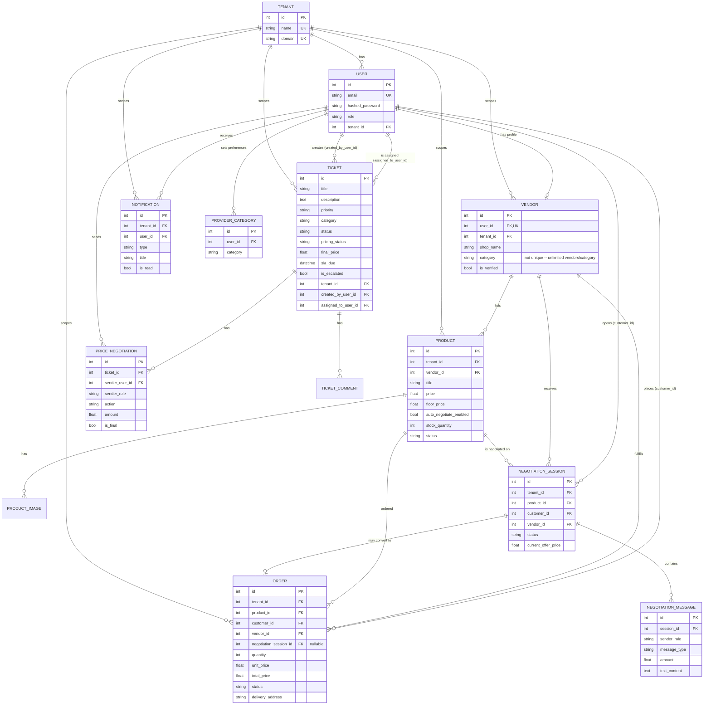
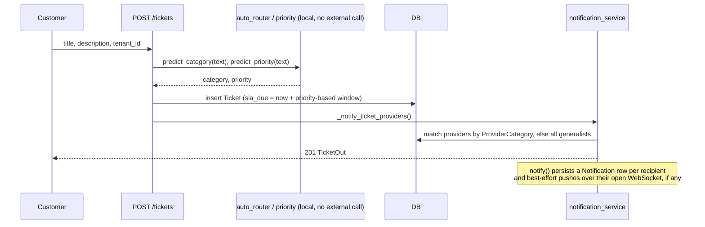
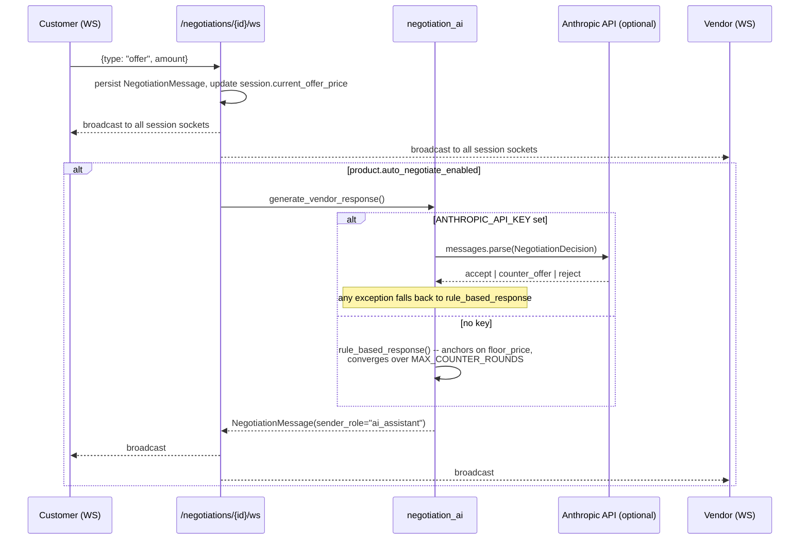
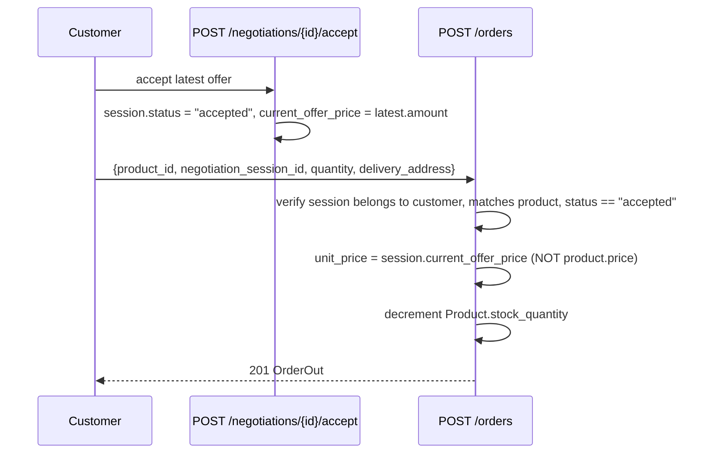

# Low-Level Design — AI Ticketing System & Marketplace

Companion to `HLD.md`. Covers schema, the full API surface, and sequence diagrams for the
flows that aren't obvious from reading a single file.

## 1. Entity-relationship diagram



Migrations live in `backend/alembic/versions/` (0001–0007). Every migration in this project has
been hand-verified byte-for-byte against `Base.metadata.create_all()` on a scratch SQLite DB
before being committed, rather than autogenerated — there is no `alembic revision --autogenerate`
step in the workflow.

## 2. API catalog

All routes are prefixed as shown; all except `/auth/*`, `/vendors/register`,
`/vendors/categories`, and the legal-page-adjacent public GETs require `Authorization: Bearer
<jwt>`.

### Auth (`/auth`)
| Method | Path | Notes |
|---|---|---|
| POST | `/register`, `/register-simple` | Create account, returns token |
| POST | `/login` | Returns token |
| GET | `/me` | Current user |

### Tickets (`/tickets`)
| Method | Path | Notes |
|---|---|---|
| POST | `/` | Create; runs local AI category+priority classification |
| GET | `/`, `/{id}`, `/tenant/{tenant_id}` | List/detail, tenant-scoped |
| PUT | `/{id}/status` | Any authenticated tenant member; validates allowed status set |
| PUT | `/{id}/assign/{user_id}` | Admin only |
| GET | `/customer/my-tickets`, `/provider/my-tickets`, `/provider/open` | Role-scoped lists |
| POST | `/provider/offer/{id}` | Provider self-assigns |
| PUT | `/provider/{id}/status` | Provider updates own ticket; blocks the jump to in-progress/resolved/closed until `pricing_status == "finalized"` |
| POST | `/admin/run-sla-check` | Manual trigger, same logic as the 30s background sweep |
| GET/POST | `/{id}/bargaining`, `/bargaining/offer`, `/bargaining/accept`, `/bargaining/reject` | Ticket-side price bargaining (HTTP, not WebSocket) |
| GET | `/bargaining/monitor` | Admin dashboard feed |
| POST | `/ai-create` | AI-assisted ticket creation path |

### Comments (`/comments`)
`POST /{ticket_id}`, `GET /{ticket_id}`.

### Users (`/users`)
| Method | Path | Notes |
|---|---|---|
| POST | `/` | Admin-style direct create |
| GET | `/`, `/providers` | Tenant-scoped lists |
| PUT | `/me` | Self-service profile edit (name/email only — role/tenant immutable here) |
| PUT | `/me/password` | Requires current password |
| GET/PUT | `/me/categories` | Provider category preferences, drives ticket-notification routing |
| POST | `/create-default-users` | Admin-only demo seeding |

### Providers (`/providers`), Tenant (`/tenant`)
Standard CRUD, tenant-scoped.

### SLA (`/sla`)
`PUT /check` — legacy manual trigger (older, simpler duplicate of `ticket.py`'s
`/admin/run-sla-check`; kept because nothing else calls it and removing it is unnecessary churn).

### Vendors (`/vendors`)
| Method | Path | Notes |
|---|---|---|
| POST | `/register` | Public; creates `User(role="vendor")` + `Vendor` in one call |
| GET | `/categories` | Public; per-category vendor counts (informational only, no cap) |
| GET/PUT | `/me` | Vendor's own shop profile |
| GET | `/{id}` | Public profile (strips internal fields) |
| GET | `/` | Admin list, `unverified_only` filter |
| PUT | `/{id}/verify` | Admin |

### Products (`/products`)
Paginated list (`page`/`page_size`), admin "all" view, vendor's own products, public detail,
CRUD for the owning vendor, status toggle.

### Negotiations (`/negotiations`)
| Method | Path | Notes |
|---|---|---|
| POST | `/` | Customer opens a session with an opening offer; auto-negotiate fires immediately if enabled |
| GET | `/vendor/inbox` | Vendor's sessions |
| GET | `/{id}` | Detail |
| POST | `/{id}/accept` | Either party accepts the latest priced message |
| WS | `/{id}/ws` | Live chat: text/offer/accept/reject; broadcasts to all sockets on the session; triggers the AI response inline when applicable |

### Orders (`/orders`)
`POST /` (from a product directly, or from an accepted negotiation session), `GET /my`, `GET
/vendor/received`, `PUT /{id}/status`.

### Analytics (`/analytics`)
`GET /vendor`, `GET /admin` — aggregate counts, no raw row dumps.

### Notifications (`/notifications`)
`GET /`, `GET /unread-count`, `PUT /{id}/read`, `PUT /read-all`, `WS /ws` (push-only fan-out per
logged-in user).

### Meta
`GET /`, `/health` (now checks DB connectivity, returns 503 if unreachable), `/ready`, `/ping`,
`/metrics` (cached aggregate dashboard numbers).

## 3. Sequence diagrams

### 3.1 Ticket creation → AI classification → provider notification



Category/priority classification is **100% local keyword matching** — no external API call, no
network dependency, deterministic.

### 3.2 Marketplace negotiation over WebSocket, with optional LLM assist



The LLM path never lets the model settle below `floor_price`, even if the model's own output
claims otherwise (`amount = max(amount, floor)` in `negotiation_ai.py`) — the floor is enforced
in code, not just in the prompt.

### 3.3 Negotiated purchase → order



A direct (non-negotiated) purchase skips the negotiation checks entirely and uses
`product.price` as `unit_price`.

### 3.4 SLA escalation (background thread)

```mermaid
sequenceDiagram
    loop every 30s, daemon thread
        participant BG as _sla_background_job
        participant Check as sla_monitor.check_sla()
        participant DB
        BG->>Check: call
        Check->>DB: select tickets where sla_due < now, not escalated, not resolved/closed
        Check->>DB: set is_escalated=True, status="escalated"; commit
        Note over Check: try/finally now guarantees db.close()<br/>even if the query/commit raises
        Note over BG: try/except now guarantees the loop survives<br/>one failed iteration instead of dying forever
    end
```

Before the hardening pass in this doc's companion changes, an exception on either side would
have either leaked a DB connection (`check_sla`) or killed the thread permanently for the rest
of the process's life (`_sla_background_job`) — SLA monitoring would silently stop and nothing
would surface the failure until someone noticed tickets never escalating.

## 4. Known limitations / deferred work

Documented deliberately rather than fixed, because fixing them is a real feature/refactor, not
a bug:

- **Single-instance WebSocket fan-out.** Both connection managers are in-process dicts. Running
  more than one backend instance would silently split users across instances with no shared
  state — negotiation messages sent to a socket on instance A would never reach a participant
  connected to instance B. Fix would be a Redis pub/sub layer; not needed at current scale.
- **Two separate bargaining systems** (ticket bargaining vs. marketplace negotiation) with
  different transports and no shared code — see `HLD.md` §6.
- **No admin permissions table.** Role checks are inline string comparisons per-endpoint. Fine
  for four roles; would not scale to configurable roles/permissions.
- **List endpoints have a hard 500-row safety cap but no pagination UI.** `products` already has
  real page/page_size pagination; tickets/orders/vendors/users do not yet expose "load more" in
  the frontend, they just stop silently at 500 rows server-side rather than returning unbounded
  data.
- **No self-service account deletion or payment capture** — both require an admin/manual process
  today; the legal pages describe this accurately rather than promising a flow that isn't built.
