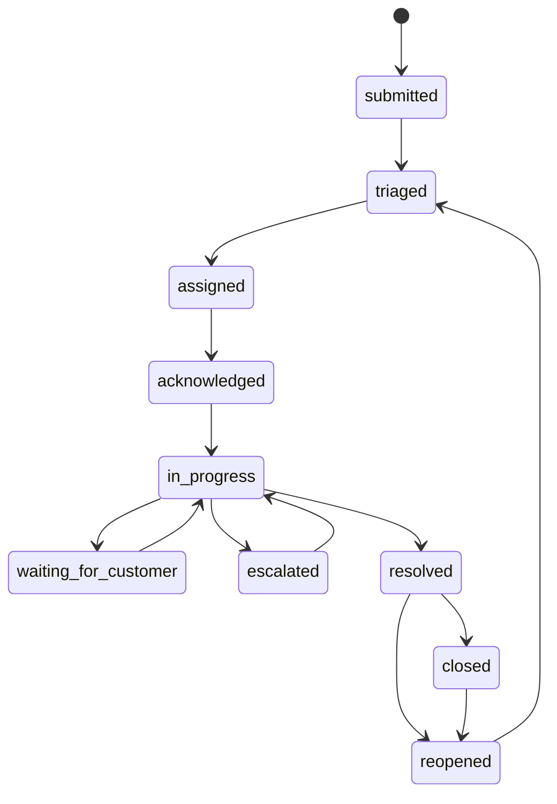
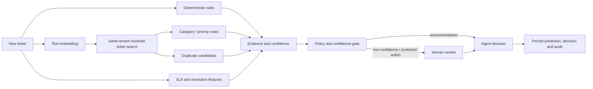
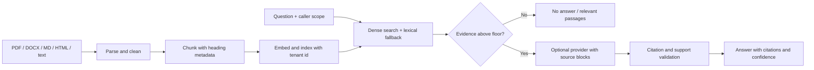
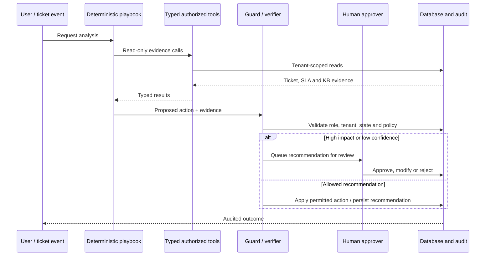
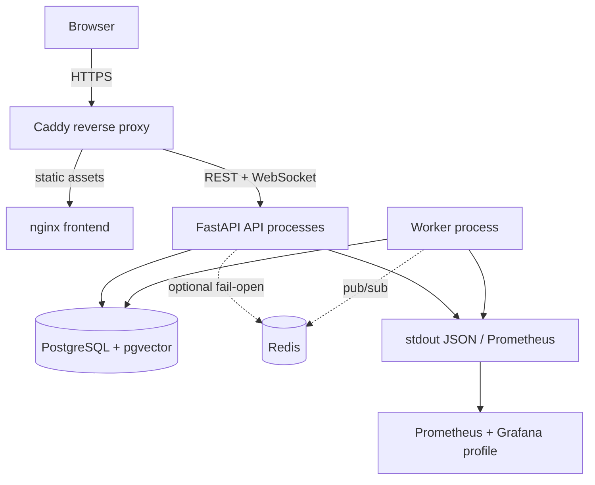
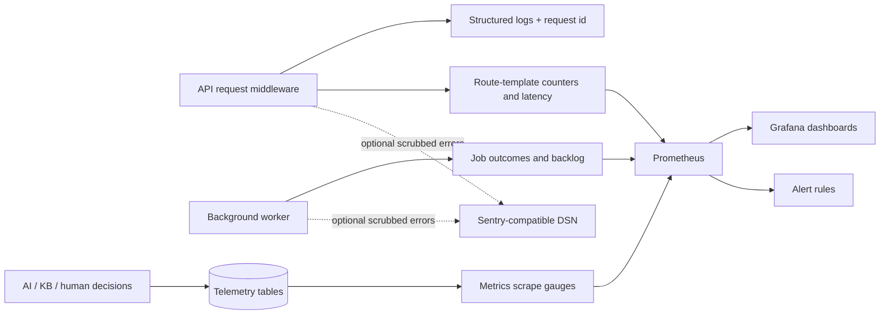
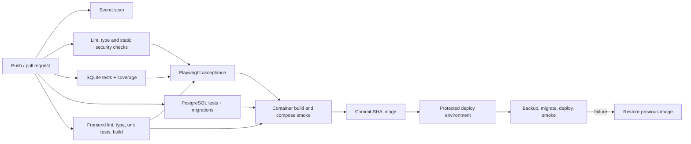

# Architecture diagrams

These diagrams describe the checked-in modular-monolith design and deployment configuration.
The production topology is prepared but is not yet running at a public URL.

## Ticket lifecycle

Each accepted transition writes status history and an audit record with actor/source and reason.
The service state machine and role permissions remain authoritative.

## AI recommendation pipeline

## Knowledge retrieval and answer flow

## Bounded agent workflow

## Deployment topology

## Observability flow

## CI/CD flow

The deployment step only runs after owner-managed host credentials and protected environment
approval are configured. PostgreSQL, container, and public network verification must be performed
against the actual deployment target.
