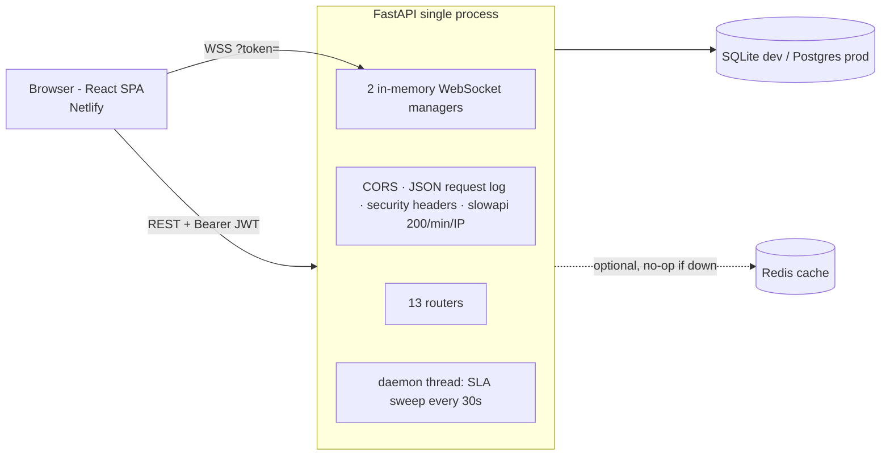

# Current Architecture — Baseline Audit (Priority 0)

**Audit date:** 2026-09-30 · **Commit audited:** `335a331` (branch `main`)
**Scope:** everything tracked in git (233 files). Findings marked **[verified]** were
reproduced by running code; everything else is from reading source.

This document is the "before" picture. It describes the system exactly as it exists, so every
later change has a reference point. It deliberately does not describe planned work — see
[`execution_plan.md`](execution_plan.md) for that.

---

## 1. What the system is today

A two-product web app sharing one auth/user model:

| Surface | What it does | Share of backend code |
|---|---|---|
| **Ticketing** | Customers file tickets; keyword rules set category + priority; providers pick tickets up; a per-ticket price is bargained (offer/counter/accept/reject) before work can start; a background thread flags tickets past `sla_due`. | ~45% |
| **Marketplace** | Vendors list products; customers browse, bargain with the vendor over a WebSocket chat, add to cart, check out into orders; admin verifies vendors and moderates products. | ~40% |
| Shared | Tenants, users, JWT auth, notifications (DB + WebSocket push), `/metrics`. | ~15% |

The ticket flow is modelled on a **paid home-services job** (customer ↔ provider price
negotiation), not on internal IT/enterprise service management. There is no concept of a
support team, queue, agent group, internal note, or organization-level SLA policy.

## 2. Repository structure

```
/                                   docs, CI, deploy configs (render.yaml, netlify.toml, docker-compose.yml)
├── ai-ticketing-system/backend     FastAPI app (app/), Alembic (8 migrations), pytest suite (13 files)
│   ├── app/routers                 13 routers, 77 routes (incl. 2 WebSockets, docs)
│   ├── app/services                auto_router (keyword category), SLA loops, notifications, WS managers
│   ├── app/ai/priority.py          keyword priority rules
│   ├── app/ml/*.py                 EMPTY files (0 bytes) — placeholders, never implemented
│   ├── app/crud, app/schemas/schemas.py, app/core/deps.py   dead code (0% coverage, never imported)
│   └── fix_db.py, init_users.py, create_demo_users.py, sqlite3.exe   ad-hoc scripts; fix_db.py DROPS the tickets table
├── ai-ticketing-system/frontend    Create React App (react-scripts 5), React 18, MUI 7, Chart.js, 31 pages
├── docs/HLD.md, docs/LLD.md        existing design docs (accurate for the marketplace side)
├── streamlit_app.py                Streamlit wrapper that shells out to uvicorn — not a real deploy path
└── startup.ps1                     hard-codes C:\Users\dheer\OneDrive\Desktop\PROJECT1 (a different path)
```

## 3. Architecture



* **Modular monolith** in one process. Fine for this scale — keep that shape.
* **Background work** is a `threading.Thread` started in the lifespan hook; no queue, no retry,
  no dead-letter. Each extra Uvicorn worker (or each `TestClient`) starts another copy.
* **Real-time** push uses per-process dictionaries of sockets, so it only works with one
  instance.
* **Redis** is used only as an optional response cache for `/metrics`, analytics and product
  listings. It fails open (degrades to no cache) — a good pattern to keep.

## 4. Data model (ticketing side)

| Table | Notable columns | Gaps |
|---|---|---|
| `tenants` | name, domain | no plan/settings, no membership table |
| `users` | email (unique global), hashed_password, `role` (free-text string), tenant_id | one tenant per user; no email verification, reset, invite, active flag, last login |
| `tickets` | title, description, priority, category, status (free-text), pricing_status, final_price, sla_due, is_escalated, created_by, assigned_to | no team, subcategory, channel, first-response time, resolved_at, closed_at, reopen count, source of AI decision |
| `ticket_comments` | content, ticket_id, created_at | **no author, no visibility (internal vs customer)** |
| `price_negotiations` | ticket bargaining history | marketplace-style, not ITSM |
| `notifications`, `provider_categories`, `providers` | | `providers` table is unused by the ticket flow |

Missing entirely: status history / audit log, attachments, teams/queues, SLA policies,
AI prediction records, feedback/CSAT, knowledge base.

Indexes: only primary keys, `users.email`, and marketplace foreign keys. **`tickets.tenant_id`,
`tickets.status`, `tickets.created_by_user_id`, `tickets.assigned_to_user_id` and
`tickets.sla_due` have no indexes**, although every list query and the SLA sweep filter on them.

Alembic: 8 migrations, **0 drift** against the ORM models [verified by `alembic upgrade head`
on a fresh DB + `compare_metadata`]. `init_db()` additionally calls `create_all()` and runs
SQLite-only `ALTER TABLE` shims at every startup — two schema-management paths in parallel.

## 5. Authentication & authorization

* bcrypt hashing (cost 12), HS256 JWT, **30-hour** token lifetime, no refresh/revocation.
* The committed default `SECRET_KEY` in `config.py` is detected and warned about at startup
  (good), but not refused.
* Roles are free-text strings checked inline per endpoint (`admin`, `provider`,
  `service_provider`, `customer`, `vendor`). There is no central policy.
* The frontend stores the JWT in `sessionStorage`; it sends an `X-Tenant-ID` header that the
  backend ignores (correctly — tenant is derived from the user).

### Authorization defects [all verified by reproduction]

The README claims "full data isolation per org". In practice it is not enforced:

| # | Defect | Impact |
|---|---|---|
| A1 | `POST /auth/register` accepts caller-supplied `role` **and** `tenant_id` | Anyone on the internet can make themselves **admin of any organization** |
| A2 | `POST /auth/register-simple` (the one the UI uses) accepts `role=admin` | Same, within the default tenant |
| A3 | `POST /users/` has **no authentication** and accepts role + tenant | Same as A1 |
| A4 | `POST /tenants/` and `GET /tenants/{id}` are unauthenticated | Tenant enumeration and creation |
| A5 | `GET /metrics` is unauthenticated and aggregates across **all** tenants | Cross-tenant data leak |
| A6 | `PUT /sla/check` is unauthenticated and mutates tickets in all tenants | Unauthenticated write |
| A7 | Seeded default credentials `admin@gmail.com / admin123` (plus provider/customer) are created at every startup, in every environment | Known-password admin on any deploy |
| A8 | Any customer can `GET /tickets/{id}` for any ticket in their tenant | Intra-tenant IDOR |
| A9 | Any customer can comment on, and `PUT /tickets/{id}/status` (e.g. **close**) any ticket in their tenant | Intra-tenant unauthorized write |
| A10 | Status can move between any two values (e.g. `closed → open`) with no reason and no record | No lifecycle integrity, nothing to audit |

These make the current deployment unsafe for real external users. They are the first thing
Priority 1 fixes.

## 6. "AI" functionality — what actually exists

| Claimed | Actual implementation |
|---|---|
| "AI routing" / "intent classifier" | `auto_router.predict_category`: first-match substring search over 5 keyword lists → one of 6 categories |
| "AI priority" | `ai/priority.predict_priority`: first-match substring search over 3 keyword lists |
| `app/ml/priority_model.py`, `routing_model.py` | **Empty files** |
| "cutting manual triage effort by an estimated 40%" (README) | **No measurement, dataset or experiment behind this number.** Must be removed. |

Behavior spot-checks [verified]:

| Input | Output | Why |
|---|---|---|
| "I cannot log in to my payroll account" | `General` | no keyword matches |
| "Please ignore the systems check email" | `IT Support` | substring `system` |
| "the coffee machine is not working" | priority `high` | `not working` |
| "our demo server down for planned maintenance next week" | priority `critical` | `server down` |

There is no model, dataset, evaluation, confidence score, explanation, or human-override
record. Substring matching also fires inside other words (e.g. `light` inside `highlight`).
**These rules are useful only as a deterministic fallback / safety layer** — they will be
kept in that role and measured as the baseline, not presented as AI.

## 7. SLA

* SLA hours are hard-coded by priority (2/6/12/24h) inside two route handlers (duplicated).
* Two different SLA sweeps exist with different rules: `sla_monitor.check_sla` (background
  thread; sets `status="escalated"`, excludes resolved/closed) and
  `sla_checker.check_and_escalate_sla` / `routers/sla.py` (manual; does not change status,
  only excludes closed). `"escalated"` is not in the list of statuses the API accepts.
* No first-response SLA, no business hours, no pause while waiting on the customer, no
  breach record — only a boolean `is_escalated`.

## 8. Frontend

* Create React App (`react-scripts 5`, no longer maintained), React 18, MUI 7, Chart.js.
* 31 pages: ticketing (Dashboard, Tickets, CreateTicket, AiTicketCreate, TicketDetails,
  AdminPanel, AdminAssign, ProviderTickets, ProviderActions, Users) + marketplace (12 pages)
  + legal/settings. Heavy visual layer (splash intro, glassmorphism, tilt cards,
  celebration animation).
* Role gating in the UI is client-side only (`ProtectedRoute` checks that a token exists,
  not the role) — acceptable only because the backend is the authority, which today it
  isn't (see §5).

## 9. Tests & quality [verified]

| Item | Result |
|---|---|
| Backend suite | **163 passed**, 0 failed (pytest, in-memory SQLite) |
| Backend line coverage | **70%** (2,478 statements, 749 missed) |
| Suite runtime | **264 s** — ~1.8 s *setup* per test, because every `TestClient` re-runs the app lifespan (bcrypt-hashes 3 seed users, starts another SLA thread, retries Redis) |
| Tenant-isolation tests | Test cross-tenant 403 on a few endpoints; do **not** cover A1–A10 |
| Frontend suite | **34 passed** in 8 suites (Jest + React Testing Library) |
| Frontend line coverage | **12.9%** |
| Frontend production build | Succeeds; main bundle **290.8 kB gzipped** JS + 9.6 kB CSS |
| Local tooling note | Frontend test run took 175 s and the build 6 min. The repo lives in a OneDrive-synced folder, which slows `node_modules` I/O; timings are not representative of CI |
| Lint in CI | `ruff --select E,F,W` only; no type checking, no security scan |

## 10. Deployment & operations

| Item | State |
|---|---|
| Docker | Backend: slim image, non-root, healthcheck, runs `alembic upgrade head` on start. Frontend: multi-stage → unprivileged nginx. Good — keep. |
| docker-compose | Postgres 16 + Redis 7 + backend + frontend with healthchecks. Enables demo seed data. |
| Render (`render.yaml`) | Free plan, **no pre-start migration**, `CORS_ORIGINS="*"`, demo seed on. Docs say auto-deploy is off. |
| Live backend `ai-ticketing-system-3.onrender.com` | **Unreachable** — no response to `/health` or `/ping` within 90–120 s (2026-09-30) |
| Live frontend `ticketmind.netlify.app` | HTTP 200 — but with no reachable API it cannot log in |
| CI (GitHub Actions) | Python 3.11/3.12 on SQLite, a Postgres job, Node 18/20 tests + build, Docker build + smoke. No deploy stage, no security checks. |
| Observability | JSON logs with method/path/status/duration. No request IDs, no metrics, no tracing, no error tracker. |
| Secrets | `.env` git-ignored. A default `SECRET_KEY` is committed in `config.py`. |

## 11. Baseline performance [verified, local]

Single sequential client, local Uvicorn (1 process), SQLite file DB, Redis absent,
Python 3.12.7, 12 logical CPUs / 16 GB RAM, Windows 11. **Not a load test** — it only fixes
a reference point for later comparisons.

| Endpoint | n | p50 ms | p95 ms | p99 ms | errors |
|---|---|---|---|---|---|
| `GET /health` | 200 | 7.1 | 9.7 | 10.8 | 0 |
| `POST /tickets/` | 150 | 55.2 | 65.7 | 79.8 | 0 |
| `GET /tickets/` (≤150 rows) | 200 | 28.5 | 38.4 | 47.1 | 0 |
| `GET /tickets/1` | 200 | 16.8 | 21.1 | 22.4 | 0 |
| `POST /auth/login` | 15 | 698.7 | 750.9 | 751.9 | 0 |

Login cost is dominated by bcrypt; `POST /tickets/` includes synchronous notification fan-out.
Raw output: `reports/baseline/p0_latency.json`.

## 12. Strengths (keep)

1. **FastAPI modular monolith + SQLAlchemy 2 + Alembic** with zero migration drift.
2. **Real Postgres CI job** in addition to SQLite.
3. **Docker images** that are already production-shaped (non-root, healthchecks, migrate on boot).
4. **Fail-open Redis cache** wrapper.
5. **JSON structured logging** and a catch-all exception handler that doesn't leak stack traces.
6. **Notification model + WebSocket push** — reusable for ticket events.
7. Rate limiting on auth endpoints; bcrypt; security headers.
8. A sizeable, passing test suite to build on.

## 13. Limitations & technical debt

| Area | Debt |
|---|---|
| Security | A1–A10 above; 30 h JWT; committed default secret; seeded known passwords |
| Domain model | Ticket lifecycle is a price-negotiation flow, not ITSM; no teams/queues; comments have no author/visibility; no attachments; no audit trail |
| AI | Keyword rules presented as AI; empty ML modules; unmeasured 40% claim |
| SLA | Two inconsistent sweeps; hard-coded hours; no first-response SLA or breach records |
| Data | Missing indexes on the hottest ticket columns; `LIST_SAFETY_CAP=500` instead of pagination |
| Background work | Daemon thread per process; not safe with >1 worker; no retries |
| Code hygiene | Dead modules (`crud/`, `schemas/schemas.py`, `core/deps.py`, empty `ml/`); dangerous `fix_db.py`; committed `sqlite3.exe`; `startup.ps1` points at another folder; `streamlit_app.py` |
| Docs | README metrics table counts endpoints/tests rather than outcomes; "estimated 40%" is unsupported |
| Tests | Slow fixture design; no tests for the authorization defects |
| Frontend | CRA is deprecated; role gating is client-side only |
| Ops | Live backend down; no request IDs/metrics; no deploy automation |

## 14. Retain / replace / add

| Retain | Replace | Add |
|---|---|---|
| FastAPI app structure, SQLAlchemy, Alembic | Registration flow (no caller-chosen role/tenant) | Organizations + memberships + invitations |
| Postgres + Redis + Docker Compose | Free-text roles → explicit RBAC (6 roles) | Enforced ticket state machine + status history |
| Structured logging, exception handler, security headers, rate limiting | Ad-hoc status updates → validated transitions | Audit log for every important action |
| Notification table + WS push | Two SLA sweeps → one SLA policy engine | Comments with author + internal/public visibility; attachments |
| Fail-open cache wrapper | Keyword "AI" → deterministic fallback layer under trained models | Teams/queues, assignment, SLA policies, CSAT |
| Test suite (extend, speed up) | Lifespan seeding of known-password users → explicit seed script | Datasets, ML pipelines, RAG, agent, HITL (P3+) |
| Docker images, CI jobs | Daemon thread → proper worker (P2/P11) | Metrics, request IDs, dashboards (P12) |

**Marketplace module** (vendors, products, cart, orders, WebSocket bargaining; ~40% of
backend code, 12 frontend pages) and **ticket price bargaining**: working code, but unrelated
to service management. Owner decision D1: removed from the product; the last commit containing
them is tagged `legacy-marketplace`.
