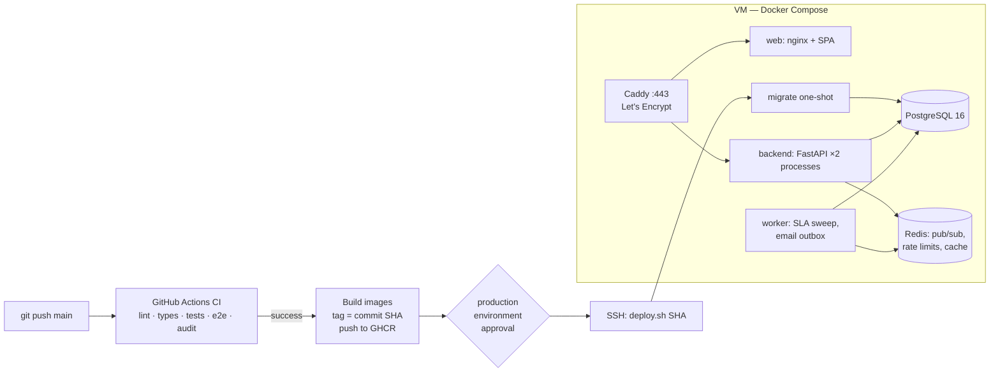

# Deployment

Target (owner decision D2): **one Linux VM running Docker Compose, with Caddy for automatic
HTTPS.** The compose deployment and rollback were rehearsed locally; real DNS, public TLS and
GitHub-to-VM deployment still require owner-managed infrastructure and credentials.
For the actionable owner checklist, including private-repository setup and pilot onboarding, see
[`external_setup_checklist.md`](external_setup_checklist.md).



## Environments

| Environment | Where | Config |
|---|---|---|
| Development | your machine: `docker compose up` or uvicorn + Vite | `backend/.env` (`ENVIRONMENT=development`) |
| Staging / public demo | a VM (can be the same one, second compose project and subdomain) | `.env` with `ENVIRONMENT=staging` |
| Production | a VM | `.env` with `ENVIRONMENT=production` |

`staging` and `production` enforce the same guard: the API and worker refuse to start with the
development secret, insecure cookies, SQLite or a low bcrypt cost.

## First deployment (one time)

1. **Create a VM**: Ubuntu 22.04 or 24.04, public IPv4, and enough CPU/RAM for the embedding
   model and database. The old 2 vCPU / 4 GB suggestion predates the AI stages and is not a
   measured capacity recommendation. Check current provider pricing and run load tests before
   selecting a long-term size.
2. **Make the repository available to the VM.** For a public repository, the HTTPS clone below
   works directly. For a private repository, first SSH to the VM as root and create the `deploy`
   account and its `.ssh` directory; generate a dedicated read-only GitHub repository deploy key
   for that account; add its public half under the GitHub repository's **Settings → Deploy keys**;
   and configure the VM's GitHub host key and SSH client to use it. Verify the GitHub host key
   fingerprint from GitHub's official documentation before trusting it. Clone the private
   repository as `deploy` into `/opt/nexadesk`. Keep this repository-read key separate from the
   CI-to-VM SSH login key in step 6.
3. **DNS**: create an `A` record for the domain pointing at the VM's public IPv4. Add an `AAAA`
   record only if IPv6 is configured and reachable. Wait until DNS resolves correctly before
   expecting Caddy to issue a public certificate.
4. **Bootstrap** (as root on the VM):
   ```bash
   # For a public repository, clone it here. A private repository should already
   # have been cloned as deploy in step 3.
   git clone https://github.com/<you>/<repo>.git /opt/nexadesk
   /opt/nexadesk/deploy/bootstrap-vm.sh nexadesk.example.com you@example.com ghcr.io/<you>
   ```
   This installs Docker, enables the firewall (22/80/443 only) and automatic security updates,
   creates a `deploy` user, generates `/opt/nexadesk/.env` with random secrets, and schedules a
   nightly database backup.
5. **Review `/opt/nexadesk/.env`** — optional: SMTP (without it, verification and reset emails
   stay in the outbox table), S3 storage, `SENTRY_DSN`, `DEMO_PASSWORD`.
6. **GitHub**:
   * make the GHCR packages readable by the VM (public packages, or `docker login ghcr.io` on the
     VM with a read-only token);
   * add repository secrets `DEPLOY_HOST` (VM IP/hostname) and `DEPLOY_SSH_KEY` (private key whose
     matching public key is in `/home/deploy/.ssh/authorized_keys`); `DEPLOY_USER` is optional and
     defaults to `deploy`;
   * create an environment named `production` and add yourself as a required reviewer.
7. **Deploy**: merge a CI-passing commit to `main`. CI builds and publishes SHA-tagged images;
   the production environment reviewer approves the deploy job; the VM backs up, migrates,
   starts the stack, and runs the smoke check. Avoid manual dispatch until that commit has a
   successful CI run.
8. **Demo data** (optional, labelled as demo everywhere):
   ```bash
   cd /opt/nexadesk && docker compose --env-file .env -f deploy/docker-compose.prod.yml \
     exec backend python -m app.scripts.seed_demo
   ```
9. **Verify** from anywhere:
   ```bash
   ./deploy/smoke.sh nexadesk.example.com
   python deploy/verify_realtime.py https://nexadesk.example.com   # ~2 min, creates a throwaway org
   ```

## Routine operations

| Task | Command (on the VM, in `/opt/nexadesk`) |
|---|---|
| Deploy a build | `./deploy/deploy.sh <sha>` — backup → pull → migrate → start → smoke test; **automatic rollback** if start or smoke fails |
| Roll back code | `./deploy/rollback.sh` (previous) or `./deploy/rollback.sh <sha>` |
| Undo a schema change | `./deploy/restore.sh backups/pre-deploy-<sha>.dump` (destructive, asks for confirmation) |
| Manual backup | `./deploy/backup.sh manual` → `backups/*.dump` + attachments `.tgz`, 14-day retention |
| Logs | `docker compose --env-file .env -f deploy/docker-compose.prod.yml logs -f backend worker` |
| Status | `… ps` — every service has a health check (the worker's fails if its loop stops ticking) |

**Migrations policy.** Migrations run once per deploy in the one-shot `migrate` service (with a
PostgreSQL advisory lock as a second guard). Schema changes follow *expand → migrate code →
contract* across releases so the previous release keeps working against the new schema; that is
what makes code-only rollback safe. A change that cannot follow this pattern needs a restore
from the pre-deploy backup to roll back.

**Backups.** Nightly at 03:15 plus before every deploy, on the VM's disk. Copy them off the VM
(e.g. `rclone copy backups remote:nexadesk-backups`) — a backup on the same disk does not
survive losing the VM.

## What has been verified (local rehearsal, 2026-09-30)

On Windows 11 + Docker Desktop, with `DOMAIN=localhost` (Caddy internal CA) and
`ENVIRONMENT=staging`:

| Check | Result |
|---|---|
| Production stack starts (migrate → backend ×2 processes, worker, web, Caddy) | ✔ all healthy |
| `smoke.sh` — `/ready` (DB + migration head), SPA, API docs, 401 on anonymous API | ✔ |
| HTTPS headers — HSTS from Caddy, strict CSP on the SPA | ✔ |
| Live notifications across 2 API processes via Redis (3 of 3 pushes delivered) | ✔ `verify_realtime.py` |
| Worker-originated push (SLA breach recorded by the worker, delivered over WebSocket) | ✔ arrived 105 s after ticket creation (1-min SLA + up-to-60-s sweep) |
| Backup → mutate → restore returns the database to the backup | ✔ |
| Deploy new tag → rollback to previous tag | ✔ |
| Deploy a deliberately broken image → automatic rollback, site stays up | ✔ |

**Not yet verified:** Let's Encrypt issuance (needs a real domain), GHCR pull, SSH deploy job,
SMTP delivery — all depend on the owner-created VM, domain and secrets.

## Status label

Once live, the URL is a **public demo deployment**. It becomes "production usage" only when real
external users use it (P9), and usage metrics are reported from `data_origin = real` rows only.
