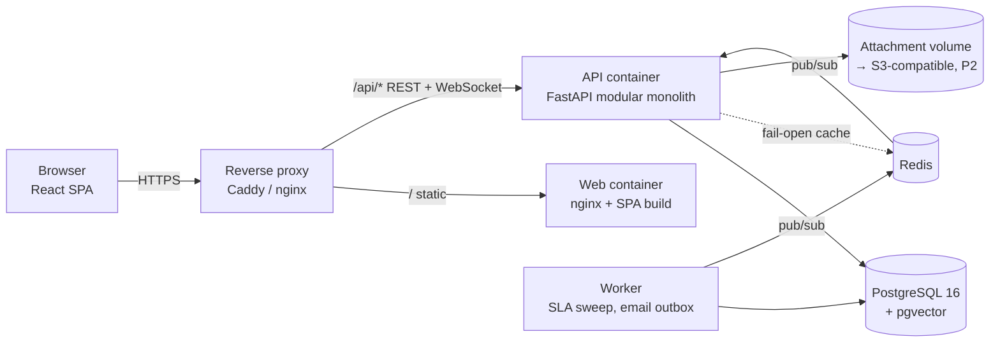
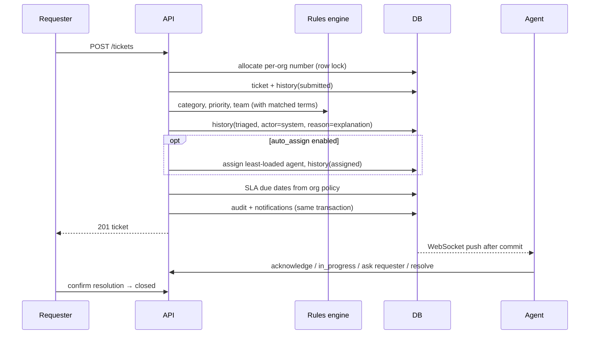
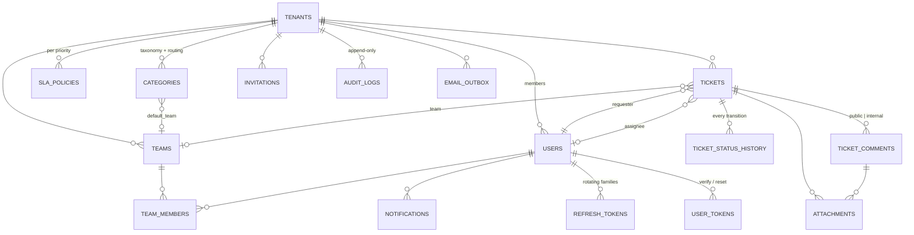
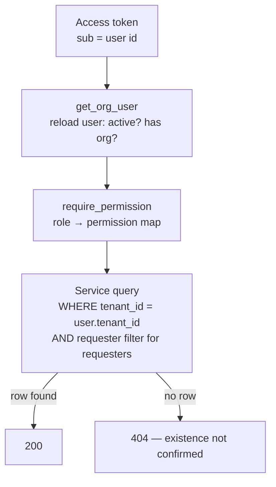

# NexaDesk AI — System Design

**Status:** living document. Sections are marked **Implemented** (in the codebase and
tested), **Planned** (designed, not built) or **Pending measurement** (built, numbers not yet
collected). Last updated at the end of Priority 2.

Contents: 1 Business requirements · 2 Functional · 3 Non-functional · 4 Architecture ·
5 Components · 6 Data flow · 7 AI architecture · 8 Database · 9 API · 10 Security ·
11 Multi-tenancy · 12 Caching · 13 Queues · 14 Observability · 15 Failure handling ·
16 Scalability · 17 Cost · 18 Trade-offs · 19 ADRs · 20 Future architecture

---

## 1. Business requirements

Internal service desks (IT, HR, facilities) receive requests through many channels and route
them by hand. The platform must: capture every request in one structured record; get it to the
right team quickly; make SLA commitments visible and enforced; keep requesters informed; and let
managers see backlog and performance — while any automation stays auditable and overridable.
The full business case is in [`business_case.md`](business_case.md) (P16).

## 2. Functional requirements (P1 scope — Implemented)

| Area | Capability |
|---|---|
| Identity | Self-service organization sign-up; portal sign-up for requesters (opt-in, domain-restricted); invitations; email verification; password reset; rotating sessions |
| Access | Six roles: platform admin, org admin, manager, agent, requester, read-only analyst |
| Configuration | Teams and membership; categories with keyword rules and a default team (routing table); SLA policy per priority; auto-assign, auto-close, reopen window |
| Tickets | Create; rules-based triage and routing; manual/self/auto assignment; enforced lifecycle; public replies and internal notes; @mentions; attachments; requester confirmation; reopen |
| SLA | First-response and resolution clocks; pause while waiting on the requester; breach recording; auto-escalation; auto-close |
| Visibility | Role-aware ticket views (my work, team queue, SLA monitor); live notifications; operations dashboard; audit log |

## 3. Non-functional requirements

| Requirement | Target / mechanism | Evidence |
|---|---|---|
| Tenant isolation | Every org-scoped query filters on `tenant_id`; foreign ids return 404 | `tests/test_tenant_isolation.py` |
| Auditability | Every state change writes status history + audit entry in the same transaction | `tests/test_acceptance_p1.py` |
| Security | OWASP-aligned controls (§10) | `tests/test_security.py`, dependency audit in CI |
| Availability | Stateless API behind a proxy; health (`/health`) and readiness (`/ready`: DB + migration head) | Container healthchecks |
| Performance | **Pending measurement** — targets are set after the P10 baseline, not before | — |
| Portability | Same code on SQLite (tests) and PostgreSQL 16 (prod); whole suite runs on both | CI jobs |

## 4. Architecture

Additional lifecycle, AI, RAG, agent, deployment, observability and CI/CD diagrams are in
[`architecture_diagrams.md`](architecture_diagrams.md).

A **modular monolith** (FastAPI) with PostgreSQL, Redis and — from P2 — a background worker,
behind a single reverse proxy that also serves the SPA.



**Modules inside the API** (by package): `auth` + `users` (identity, sessions), `organizations`
+ `org_config` (tenants, members, invitations, teams, categories, SLA policies), `tickets`
(lifecycle, comments, attachments), `sla` (sweep), `notifications` (DB + WebSocket push),
`analytics`, `audit_logs`, `platform`. Domain rules live in `app/services/`; routers are thin.

## 5. Components

| Component | Responsibility | Tech |
|---|---|---|
| SPA | All user interfaces; access token in memory; session restore via refresh cookie | React 19, TypeScript, MUI 7, TanStack Query, Vite |
| API | REST + WebSocket; all authorization decisions | FastAPI, SQLAlchemy 2 (typed), Pydantic 2 |
| Rules engine | Deterministic triage baseline and fallback (`app/ai/rules.py`) | Python regex word-boundary matching |
| Worker | SLA sweep + email outbox delivery; heartbeat health check | `python -m app.worker` |
| SLA sweep | Breaches, escalation, auto-close; idempotent, `SKIP LOCKED` | Worker (or in-process in dev) |
| Email | Transactional outbox → console (dev) / SMTP; retry with backoff, dead letter | `email_outbox` table |
| Realtime | Redis pub/sub fan-out to every API process's WebSockets | `services/realtime.py` |
| Storage | Attachment bytes under random keys, validated by extension + magic bytes | Local volume or S3-compatible |
| Error monitoring | Sentry-compatible, PII and credentials scrubbed; off without a DSN | `core/monitoring.py` |

## 6. Data flow — creating and working a ticket



## 7. AI architecture

**Rules engine (P1, unchanged):** deterministic keyword rules — labelled *System rule* in the UI,
never *AI*. It triages every ticket synchronously at creation and remains the fallback whenever
the AI is disabled, unavailable, or has too little history.

**AI-assisted triage (P5, Implemented).** Chosen by measurement (P4, `reports/classification/`):
every organization has its own taxonomy, so the shipped method learns from *that organization's*
resolved tickets instead of a global model.

```
ticket created ──(same transaction)──► jobs: ai.triage          (API returns immediately)
worker: run_due_jobs ─► embed title+description (FastEmbed ONNX, CPU, model baked into the image)
                     ─► ticket_embeddings upsert (pgvector vector(384), HNSW cosine index)
                     ─► k-NN search: same tenant + same model only (tenant filter in the SQL)
                     ─► similarity-weighted votes over similar *resolved* tickets
                           category · priority · team → assignee (history + current workload)
                     ─► expected resolution time (weighted median of neighbours)
                     ─► possible duplicate (open or ≤30 days old, similarity ≥ org threshold)
                     ─► SLA-breach risk (empirical survival over the org's history, n ≥ 20)
                     ─► next steps (rules, labelled as such)
                     ─► ai_predictions rows (model, version, input hash, confidence, evidence, latency)
                     ─► policy: auto-apply only kinds the org enabled, above its threshold
```

* **Human in the loop by default.** Every recommendation is *proposed* until a person accepts,
  edits or rejects it (`POST /ai/predictions/{id}/decision`); the decision, who made it and the
  final value are stored. Organizations may enable automatic application for low/medium-risk
  kinds (category, priority, team, assignee) above a confidence threshold; duplicates and
  generated text are never auto-applied (`app/ai/policy.py`). Auto-applied changes are written
  with `actor_type="ai"`; if a person later changes that field the prediction becomes
  `overridden` — the numerator of the automation false-positive rate.
* **Evidence, not just a label.** Each recommendation carries the similar tickets it came from,
  the vote distribution, and the policy verdict. Requesters never see AI output.
* **Cold start.** Below `ai_min_history` similar resolved tickets no AI vote is issued. History
  from a previous helpdesk can be imported (`python -m app.scripts.import_history`).
* **Failure isolation.** AI runs in the worker through the PostgreSQL job queue (lease,
  retry with backoff, dead-letter). A failed analysis leaves the rules triage in place and shows
  "analysis failed" to staff; ticket creation never waits on or fails because of the model.
* **Measured quality** is reported in `reports/` (offline, P4) and live per organization at
  `GET /analytics/ai-performance` (acceptance, override and automation false-positive rates,
  latency) — computed from decision records, never hard-coded.

**Generated text (P5, Implemented; off until configured).** Ticket summaries and reply drafts go
through `app/ai/llm.py` (Anthropic or OpenAI over HTTPS). Nothing is enabled implicitly: it needs
`LLM_PROVIDER` *and* `LLM_API_KEY`. Every call is written to `llm_calls` (feature, model, tokens,
latency, outcome, cost when prices are configured) and counted against a per-organization monthly
token budget. Reply drafts see only what the requester can see plus resolution notes of similar
resolved tickets — never internal notes — and are sent only when an agent accepts or edits them.

**Knowledge base and grounded answers (P6, Implemented).**

```
upload (MD/TXT/HTML/PDF/DOCX) ─► extract text (headings kept) ─► kb_documents (status=processing)
worker: kb.ingest ─► heading-aware chunks (~1,000 chars, 150 overlap) ─► embed title + heading + text
                  ─► kb_chunks: vector(384) + HNSW · generated tsvector + GIN (PostgreSQL)
query ─► dense top-30 (pgvector) ∥ lexical top-30 (websearch_to_tsquery, OR fallback)
      ─► dense ranking; full-text ranking only if no dense hit clears the relevance floor
         (exact codes) ─► optional cross-encoder over the top 20 (off by default)
      ─► relevance gate ── nothing relevant → "not in the knowledge base" (no model call)
      ─► LLM with numbered <source> blocks ─► citation check (numbers exist; each cited sentence's
         content words mostly present in a cited source) ─► answer + sources + supported share
```

* Tenant and visibility filters are in the retrieval SQL: requesters only ever retrieve
  *published* articles; staff also see internal runbooks.
* Retrieved text is untrusted: delimited, our delimiters inside it neutralized, and the system
  prompt forbids following instructions from sources. An answer that cites nothing is not shown.
* Without an LLM provider the same endpoint returns ranked passages (search mode), so the
  feature degrades to search rather than failing.
* Every search/question is logged in `kb_queries` (outcome, top score, cited chunks, latency,
  helpful yes/no) — the source for KB analytics and, with real users, deflection metrics.
* Surfaces: Knowledge-base page (search/ask, article management), "These articles might solve it"
  while a requester writes a ticket, and "Related articles" in the agent's AI panel.

**Agent workflow (P7, implemented):** `app/agent/runner.py` runs a deterministic planner/playbook,
typed tools, authorization and policy checks, verification, audit/AI run recording, and a human
approval path for protected actions. The agent is not an unrestricted LLM planner. Tool and
security regression coverage lives in `backend/tests/test_agent.py` and `test_threats.py`.

**Human oversight (P8, implemented):** recommendations carry confidence/evidence and can be
accepted, edited, rejected, or escalated. Protected decisions enter the approval queue; the
frontend exposes the queue and per-ticket AI panel. AI acceptance/override and feedback are
recorded. No real-user acceptance rates exist until a real pilot runs.

## 8. Database architecture



Design points:

* **Timestamps** are `timestamptz` on PostgreSQL via a `UTCDateTime` type that also makes SQLite
  return aware UTC values — application code never mixes naive and aware datetimes.
* **Indexes** follow the query patterns: `tickets(tenant_id, status | assigned_to | created_by |
  team_id | created_at)`, `tickets(resolution_due)` for the SLA sweep, `audit_logs(tenant_id,
  created_at)`, `notifications(user_id, is_read)`. Their effectiveness is measured in P11.
* **Ticket numbers** are per organization (`#1, #2, …`) from a counter row updated inside the
  creating transaction — the row lock serializes concurrent creations in one org only.
* **`data_origin`** (`real` / `demo` / `synthetic`) on tenants, users and tickets keeps demo and
  generated data out of real-usage metrics.
* **Migrations:** Alembic; `tests/test_migrations.py` fails the build if `upgrade head` and the
  ORM models disagree (checked on PostgreSQL in CI).

## 9. API architecture

REST under `/api/v1`, OpenAPI at `/api/docs`. Conventions: `{items, total, page, page_size}`
pagination; errors as `{"detail": ...}`; 401 unauthenticated, 403 not permitted, **404 for
resources in other organizations**, 409 illegal state transition, 422 validation. Every response
carries `X-Request-ID` (accepted from the caller when well-formed). The WebSocket
(`/api/v1/notifications/ws`) authenticates with its first message so tokens never appear in URLs.

## 10. Security architecture (Implemented, hardened further in P14)

| Threat | Control |
|---|---|
| Privilege escalation at sign-up (audit A1–A3) | Role and tenant are never caller-supplied |
| Cross-tenant / IDOR (A4–A9) | Tenant filter in every query; requester filter for requesters; 404 on foreign ids; matrix tests |
| Session theft | 15-min access tokens in memory; httpOnly SameSite refresh cookie scoped to `/api/v1/auth`; rotation with reuse detection revoking the family |
| Credential attacks | bcrypt (12 rounds, enforced in prod); password policy; constant-time user lookup; per-route rate limits |
| Token leakage | Verification/reset/invite tokens stored as SHA-256 hashes, single-use, expiring |
| Malicious uploads | Extension allow-list + magic-byte check, UTF-8 check for text, size cap, random storage keys, `Content-Disposition: attachment` + `nosniff` |
| XSS / clickjacking | React escaping; strict CSP on the SPA; `default-src 'none'` on API responses; `X-Frame-Options: DENY` |
| Misconfiguration | Staging/production refuse to boot with the dev secret, insecure cookies, SQLite or low bcrypt cost |
| Shared demo accounts | Demo orgs cannot change passwords/settings, invite, or reset passwords by email |
| Vulnerable dependencies | `pip-audit` and `npm audit` in CI; replaced `python-jose` (unfixable `ecdsa` advisory) with PyJWT |

## 11. Multi-tenancy



Model: **shared database, shared schema, row-level tenant key** (ADR-4). The claims in the token
are hints; the user row is re-read on every request so role changes and deactivation apply
immediately. PostgreSQL row-level security as a second line of defence is evaluated in P14.

## 12. Caching (Implemented — P11)

Redis, always fail-open. **Dashboard aggregates** are cached per organization for 30 s
(`ANALYTICS_CACHE_SECONDS`; the page refreshes every 30 s and shows `generated_at`) — added because
the overview was the slowest endpoint under load (p50 530 ms at 250 users, `reports/load/`). Also in
Redis: rate-limit counters and the WebSocket fan-out. Nothing else is cached: no measurement asked
for it.

## 13. Queues (Implemented — P2)

**Email:** producer (`queue_email`, inside the business transaction) → `email_outbox` table
(queue) → worker (`deliver_pending`, one message per transaction, `FOR UPDATE SKIP LOCKED`) →
result (`sent`) → retry (`failed`, exponential backoff 1→60 min) → dead letter (`dead` after 5
attempts, error retained). **Scheduled work:** the SLA sweep. Both are idempotent, so any number
of worker replicas is safe.

Why a PostgreSQL-backed queue instead of Redis (ADR-17): enqueueing is transactional with the
change that caused it (no "email for a rolled-back change"), no extra durable store to operate,
and the throughput needed is far below what a `SKIP LOCKED` queue sustains. Revisit when P6
document ingestion needs high-volume jobs.

## 14. Observability (Implemented — P12/P13)

| Signal | Where | Notes |
|---|---|---|
| Structured logs | stdout JSON (API, worker, Caddy) | request id on every line and in `X-Request-ID`; no request bodies |
| Metrics | `GET /metrics` (API, multi-process aggregated), worker `:9101/metrics` | bearer `METRICS_TOKEN`; not routed by Caddy. Request rate/latency by route template, job outcomes and duration, agent run time and step outcomes, human decisions, LLM calls/tokens, KB queries; backlog gauges (jobs, outbox, pending recommendations, KB indexing, drift alerts) read from PostgreSQL at scrape time |
| Dashboards | Grafana (`docker compose --profile observability`) | provisioned "NexaDesk — service overview" (`deploy/observability/`), 127.0.0.1 only |
| Alerts | Prometheus rules (`deploy/observability/alerts.yml`) | target down, 5xx > 2%, p95 > 1 s, job backlog > 10 min, dead jobs, dead email, AI rejections, AI drift. No Alertmanager receiver until the owner picks a channel |
| Errors | Sentry-compatible DSN (optional) | PII scrubbed |
| AI telemetry | `ai_predictions`, `agent_runs`, `llm_calls`, `kb_queries` tables → `/analytics/ai-performance`, `/analytics/kb`, `/analytics/pilot` | per organization, computed, never hard-coded |
| AI monitoring | daily `ai_monitoring` run per organization | category PSI, embedding-centroid drift, novelty rate, acceptance trend (`app/ai/monitoring.py`); model promotion gated by `experiments/regression_gate.py` |

## 15. Failure handling

| Failure | Behaviour |
|---|---|
| Redis down | Cache misses; no request fails |
| Email delivery fails | Outbox row marked `failed` with error, retried up to 5 times; the request that queued it still succeeds |
| WebSocket push fails | Notification row is committed regardless; the client sees it on next fetch |
| Two SLA sweepers at once | `FOR UPDATE SKIP LOCKED` + guarded updates → each ticket processed once |
| Transaction rollback | Pending notifications discarded (`after_rollback`) — no alerts about changes that didn't happen |
| Unhandled exception | Logged with request context; generic 500 body, no stack trace |

## 16. Scalability (measured locally — P10/P11)

API processes are stateless (Redis fan-out and rate limits), the worker scales by replicas and every
job is idempotent. Measured on a laptop with 100k synthetic tickets (`reports/load/README.md`):
within target at 100 concurrent users (~30 req/s, p95 150 ms), error-free to 250 users, saturating
at ~65–70 successful req/s. Changes made because of those runs: async session teardown (a
threadpool/connection-pool **deadlock** under load), dashboard cache, trigram indexes for ticket
search (75 → 20 ms per query at 100k tickets), model warm-up at start, and optional per-process
**backpressure** (`API_LIMIT_CONCURRENCY`: overload answers 503 at once instead of hanging).
Pool size and timeout are configuration (`DB_POOL_SIZE`, `DB_MAX_OVERFLOW`, `DB_POOL_TIMEOUT`);
keep processes × (size + overflow) below PostgreSQL's `max_connections`. Database volume: `reports/scale/`.

## 17. Cost considerations (P17)

See [`cost.md`](cost.md). Model inference runs locally; text generation is opt-in and usage is
ledgered. Hosted infrastructure costs and capacity remain unmeasured because there is no live
deployment or target host yet. The cost report explicitly distinguishes missing measurements
from estimates and provides a parameterized model.

## 18. Trade-offs

* **Monolith over microservices** — one team, one deploy, cross-module transactions (e.g.
  ticket + history + audit + notification commit together). Split points are recorded (§20).
* **Row-level tenancy over schema/database-per-tenant** — cheapest to operate and query across;
  isolation is enforced in code and tested exhaustively instead of by the database. Revisit for
  regulated tenants.
* **Rules before models** — the baseline is measurable, explainable, and stays as the fallback.
* **In-process SLA loop in P1** — simplest correct option; safe to run in several processes
  because it is idempotent; moves to the worker in P2.

## 19. Architecture decision records

| ADR | Decision | Status |
|---|---|---|
| 1 | FastAPI modular monolith | Accepted |
| 2 | PostgreSQL as system of record; SQLite only for the fast test tier | Accepted |
| 3 | pgvector in the same PostgreSQL for embeddings | Accepted (used from P5) |
| 4 | One organization per account; row-level tenant key | Accepted |
| 5 | Six fixed roles + central permission map (`app/core/rbac.py`) | Accepted |
| 6 | Explicit ticket state machine; history + audit per transition (`app/services/tickets.py`) | Accepted |
| 7 | Redis for cache, rate limits, queue; always fail-open for cache | Accepted |
| 8 | Background worker (`app.worker`) owns the SLA sweep and email delivery in deployed environments; the in-process loop remains only for single-process development | Accepted (P2) |
| 9 | Deterministic rules remain the safety layer under every model | Accepted |
| 10 | CPU-only models sized for a small VM | Accepted |
| 11 | LLM behind a provider interface, every call logged and costed | Accepted (P5) |
| 12 | **New migration baseline.** The legacy chain (marketplace schema, tag `legacy-marketplace`) was squashed into `0001_nexadesk_baseline`. The only deployed legacy DB was unreachable; a legacy DB now fails `alembic upgrade` with an unknown-revision error instead of being silently rewritten. | Accepted |
| 13 | **Access token in memory, refresh token in an httpOnly cookie**, SPA and API on one origin behind the proxy (no third-party cookies, no CORS in production) | Accepted |
| 14 | **Transactional outbox for email and post-commit WebSocket push** — side effects only after the change commits | Accepted |
| 15 | **Replace CRA with Vite + TypeScript.** CRA is unmaintained; every old page targeted removed flows; TypeScript adds a type-check gate. Measured: production build 26 s (vs ~6 min CRA on the same machine), initial JS 250 kB gzip with charts split into the lazily loaded dashboard chunk | Accepted |
| 16 | **PyJWT instead of python-jose** — python-jose pulled in `ecdsa`, which has an advisory with no fixed release | Accepted |
| 17 | **PostgreSQL-backed queue** (outbox + `SKIP LOCKED`) rather than a Redis queue — transactional enqueue, one durable store | Accepted (P2) |
| 18 | **Single VM + Docker Compose + Caddy** for the public deployment; immutable images tagged by commit SHA; one-shot migrate service; automatic rollback on failed smoke test | Accepted (P2) |
| 19 | **Rate limiter fails open** when Redis is unavailable (availability over strictness), logged; auth endpoints keep per-route limits | Accepted (P2) |
| 20 | **psycopg 3** (SQLAlchemy 2.1's default PostgreSQL driver) instead of psycopg2 | Accepted (P2) |
| 21 | **Per-organization nearest-neighbour recommendations** over the organization's own resolved tickets instead of one global classifier: no per-tenant training step, adapts as tickets resolve, returns its evidence. Chosen from the P4 comparison (`reports/classification/production_classifier.md`) | Accepted (P5) |
| 22 | **HNSW search settings per query** (`ef_search ≥ k`, `iterative_scan = strict_order`): with pgvector defaults a filtered `LIMIT 60` returns at most 40 rows, fewer for small tenants in a shared table — measured in `reports/pipeline/` | Accepted (P5) |
| 23 | **Generic PostgreSQL job queue** (`jobs`: dedupe key, lease, backoff, dead-letter) for AI work; enqueued in the ticket's transaction | Accepted (P5) |
| 24 | **Recommend by default; automation is opt-in** per organization, per kind, above a confidence threshold; high-risk kinds never automatic | Accepted (P5) |
| 25 | **FastEmbed (ONNX Runtime) in production, PyTorch only offline** — model files baked into the image at build time, no runtime downloads | Accepted (P5) |
| 26 | **Retrieval inside PostgreSQL** (pgvector + full-text search) instead of a separate search engine: one store, one tenant filter, transactional with the rest of the data. **Dense-first, lexical fallback**: on CQADupStack equal-weight RRF scored nDCG@10 0.372 vs dense 0.407; the lexical weight chosen on validation was 0 (`reports/rag/fusion_weight.md`); cross-encoder reranking added nothing (0.408) at ~1.2 s/query, so it is off by default | Accepted (P6, revised by measurement) |
| 27 | **Refuse rather than guess**: no model call without relevant evidence; answers must cite sources and pass the support check; the no-answer path is a first-class outcome | Accepted (P6) |
| 28 | **LLM features are opt-in per deployment** (`LLM_PROVIDER` + `LLM_API_KEY`), budgeted per organization, every call in a ledger; a provider key present in the environment is ignored unless configured for NexaDesk | Accepted (P5) |
| 29 | **Async database-session teardown** on a dedicated thread limiter instead of a sync `yield` dependency — the sync form deadlocked the threadpool against the connection pool under load (P10) | Accepted (P11) |
| 30 | **Backpressure over queueing**: optional per-process concurrency cap; excess requests get an immediate 503 rather than holding connections until timeout. More processes did not add throughput on the test machine, so capacity is not "fixed" by scaling out blindly | Accepted (P11) |
| 31 | **Measure before caching**: only the dashboard aggregates are cached (30 s, per organization, fail-open) because only they were measured as a bottleneck | Accepted (P11) |

## 20. Future architecture

Extraction candidates if measurements justify them: (1) AI inference/embedding workers (CPU/GPU
heavy, different scaling curve), (2) notification fan-out service (connection-bound),
(3) analytics read replica. Each needs a measured bottleneck first.
