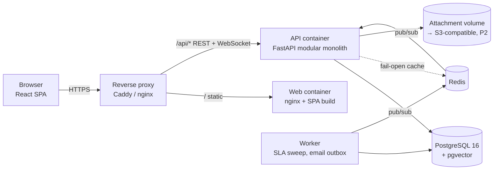
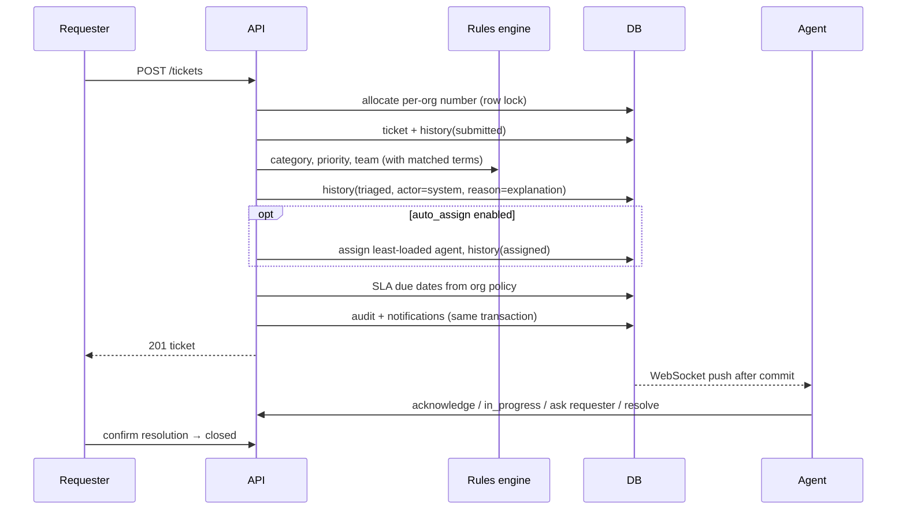
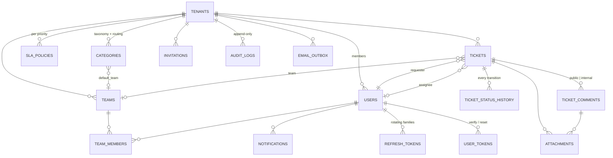
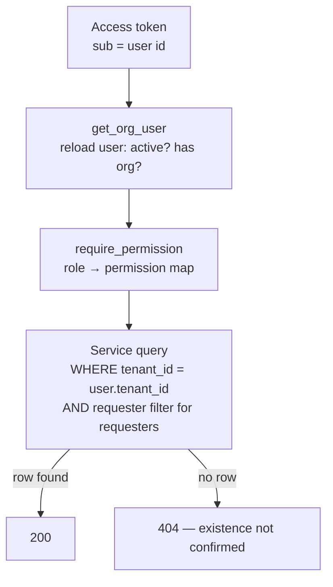

# NexaDesk AI — System Design

**Status:** living document. Sections are marked **Implemented** (in the codebase and
tested), **Planned** (designed, not built) or **Pending measurement** (built, numbers not yet
collected). Last updated at the end of Priority 2.

Contents: 1 Business requirements · 2 Functional · 3 Non-functional · 4 Architecture ·
5 Components · 6 Data flow · 7 AI architecture · 8 Database · 9 API · 10 Security ·
11 Multi-tenancy · 12 Caching · 13 Queues · 14 Observability · 15 Failure handling ·
16 Scalability · 17 Cost · 18 Trade-offs · 19 ADRs · 20 Future architecture

---

## 1. Business requirements

Internal service desks (IT, HR, facilities) receive requests through many channels and route
them by hand. The platform must: capture every request in one structured record; get it to the
right team quickly; make SLA commitments visible and enforced; keep requesters informed; and let
managers see backlog and performance — while any automation stays auditable and overridable.
The full business case is in [`business_case.md`](business_case.md) (P16).

## 2. Functional requirements (P1 scope — Implemented)

| Area | Capability |
|---|---|
| Identity | Self-service organization sign-up; portal sign-up for requesters (opt-in, domain-restricted); invitations; email verification; password reset; rotating sessions |
| Access | Six roles: platform admin, org admin, manager, agent, requester, read-only analyst |
| Configuration | Teams and membership; categories with keyword rules and a default team (routing table); SLA policy per priority; auto-assign, auto-close, reopen window |
| Tickets | Create; rules-based triage and routing; manual/self/auto assignment; enforced lifecycle; public replies and internal notes; @mentions; attachments; requester confirmation; reopen |
| SLA | First-response and resolution clocks; pause while waiting on the requester; breach recording; auto-escalation; auto-close |
| Visibility | Role-aware ticket views (my work, team queue, SLA monitor); live notifications; operations dashboard; audit log |

## 3. Non-functional requirements

| Requirement | Target / mechanism | Evidence |
|---|---|---|
| Tenant isolation | Every org-scoped query filters on `tenant_id`; foreign ids return 404 | `tests/test_tenant_isolation.py` |
| Auditability | Every state change writes status history + audit entry in the same transaction | `tests/test_acceptance_p1.py` |
| Security | OWASP-aligned controls (§10) | `tests/test_security.py`, dependency audit in CI |
| Availability | Stateless API behind a proxy; health (`/health`) and readiness (`/ready`: DB + migration head) | Container healthchecks |
| Performance | **Pending measurement** — targets are set after the P10 baseline, not before | — |
| Portability | Same code on SQLite (tests) and PostgreSQL 16 (prod); whole suite runs on both | CI jobs |

## 4. Architecture

A **modular monolith** (FastAPI) with PostgreSQL, Redis and — from P2 — a background worker,
behind a single reverse proxy that also serves the SPA.

**Modules inside the API** (by package): `auth` + `users` (identity, sessions), `organizations`
+ `org_config` (tenants, members, invitations, teams, categories, SLA policies), `tickets`
(lifecycle, comments, attachments), `sla` (sweep), `notifications` (DB + WebSocket push),
`analytics`, `audit_logs`, `platform`. Domain rules live in `app/services/`; routers are thin.

## 5. Components

| Component | Responsibility | Tech |
|---|---|---|
| SPA | All user interfaces; access token in memory; session restore via refresh cookie | React 19, TypeScript, MUI 7, TanStack Query, Vite |
| API | REST + WebSocket; all authorization decisions | FastAPI, SQLAlchemy 2 (typed), Pydantic 2 |
| Rules engine | Deterministic triage baseline and fallback (`app/ai/rules.py`) | Python regex word-boundary matching |
| Worker | SLA sweep + email outbox delivery; heartbeat health check | `python -m app.worker` |
| SLA sweep | Breaches, escalation, auto-close; idempotent, `SKIP LOCKED` | Worker (or in-process in dev) |
| Email | Transactional outbox → console (dev) / SMTP; retry with backoff, dead letter | `email_outbox` table |
| Realtime | Redis pub/sub fan-out to every API process's WebSockets | `services/realtime.py` |
| Storage | Attachment bytes under random keys, validated by extension + magic bytes | Local volume or S3-compatible |
| Error monitoring | Sentry-compatible, PII and credentials scrubbed; off without a DSN | `core/monitoring.py` |

## 6. Data flow — creating and working a ticket

## 7. AI architecture

**Implemented (P1):** only the deterministic rules engine — explicitly labelled *System rule* in
the UI, never *AI*. Every decision records the matched terms.

**Planned (P4–P8):** trained classifiers/routers, duplicate detection, SLA-breach and
resolution-time models, RAG, and an agent — each with a measured baseline (the rules engine is
the first baseline), confidence, evidence, human override, and the rules engine as the fallback
when a model is unavailable or unsure. Predictions will be persisted (`ai_predictions`) with
model version, latency and acceptance outcome.

## 8. Database architecture

Design points:

* **Timestamps** are `timestamptz` on PostgreSQL via a `UTCDateTime` type that also makes SQLite
  return aware UTC values — application code never mixes naive and aware datetimes.
* **Indexes** follow the query patterns: `tickets(tenant_id, status | assigned_to | created_by |
  team_id | created_at)`, `tickets(resolution_due)` for the SLA sweep, `audit_logs(tenant_id,
  created_at)`, `notifications(user_id, is_read)`. Their effectiveness is measured in P11.
* **Ticket numbers** are per organization (`#1, #2, …`) from a counter row updated inside the
  creating transaction — the row lock serializes concurrent creations in one org only.
* **`data_origin`** (`real` / `demo` / `synthetic`) on tenants, users and tickets keeps demo and
  generated data out of real-usage metrics.
* **Migrations:** Alembic; `tests/test_migrations.py` fails the build if `upgrade head` and the
  ORM models disagree (checked on PostgreSQL in CI).

## 9. API architecture

REST under `/api/v1`, OpenAPI at `/api/docs`. Conventions: `{items, total, page, page_size}`
pagination; errors as `{"detail": ...}`; 401 unauthenticated, 403 not permitted, **404 for
resources in other organizations**, 409 illegal state transition, 422 validation. Every response
carries `X-Request-ID` (accepted from the caller when well-formed). The WebSocket
(`/api/v1/notifications/ws`) authenticates with its first message so tokens never appear in URLs.

## 10. Security architecture (Implemented, hardened further in P14)

| Threat | Control |
|---|---|
| Privilege escalation at sign-up (audit A1–A3) | Role and tenant are never caller-supplied |
| Cross-tenant / IDOR (A4–A9) | Tenant filter in every query; requester filter for requesters; 404 on foreign ids; matrix tests |
| Session theft | 15-min access tokens in memory; httpOnly SameSite refresh cookie scoped to `/api/v1/auth`; rotation with reuse detection revoking the family |
| Credential attacks | bcrypt (12 rounds, enforced in prod); password policy; constant-time user lookup; per-route rate limits |
| Token leakage | Verification/reset/invite tokens stored as SHA-256 hashes, single-use, expiring |
| Malicious uploads | Extension allow-list + magic-byte check, UTF-8 check for text, size cap, random storage keys, `Content-Disposition: attachment` + `nosniff` |
| XSS / clickjacking | React escaping; strict CSP on the SPA; `default-src 'none'` on API responses; `X-Frame-Options: DENY` |
| Misconfiguration | Staging/production refuse to boot with the dev secret, insecure cookies, SQLite or low bcrypt cost |
| Shared demo accounts | Demo orgs cannot change passwords/settings, invite, or reset passwords by email |
| Vulnerable dependencies | `pip-audit` and `npm audit` in CI; replaced `python-jose` (unfixable `ecdsa` advisory) with PyJWT |

## 11. Multi-tenancy

Model: **shared database, shared schema, row-level tenant key** (ADR-4). The claims in the token
are hints; the user row is re-read on every request so role changes and deactivation apply
immediately. PostgreSQL row-level security as a second line of defence is evaluated in P14.

## 12. Caching (Planned — P11)

Redis wrapper exists and fails open. Candidates: dashboard aggregates, category/routing tables,
rate-limit counters. Added only with a with/without benchmark.

## 13. Queues (Implemented — P2)

**Email:** producer (`queue_email`, inside the business transaction) → `email_outbox` table
(queue) → worker (`deliver_pending`, one message per transaction, `FOR UPDATE SKIP LOCKED`) →
result (`sent`) → retry (`failed`, exponential backoff 1→60 min) → dead letter (`dead` after 5
attempts, error retained). **Scheduled work:** the SLA sweep. Both are idempotent, so any number
of worker replicas is safe.

Why a PostgreSQL-backed queue instead of Redis (ADR-17): enqueueing is transactional with the
change that caused it (no "email for a rolled-back change"), no extra durable store to operate,
and the throughput needed is far below what a `SKIP LOCKED` queue sustains. Revisit when P6
document ingestion needs high-volume jobs.

## 14. Observability

**Implemented:** JSON logs with request id, method, path, status, duration; audit log.
**Planned (P12):** Prometheus metrics, Grafana dashboards, error tracking, AI telemetry.

## 15. Failure handling

| Failure | Behaviour |
|---|---|
| Redis down | Cache misses; no request fails |
| Email delivery fails | Outbox row marked `failed` with error, retried up to 5 times; the request that queued it still succeeds |
| WebSocket push fails | Notification row is committed regardless; the client sees it on next fetch |
| Two SLA sweepers at once | `FOR UPDATE SKIP LOCKED` + guarded updates → each ticket processed once |
| Transaction rollback | Pending notifications discarded (`after_rollback`) — no alerts about changes that didn't happen |
| Unhandled exception | Logged with request context; generic 500 body, no stack trace |

## 16. Scalability

API processes are stateless and scale horizontally: WebSocket fan-out goes through Redis
pub/sub and rate-limit counters live in Redis (P2). The worker scales by adding replicas. No
capacity claim is made until P10–P11 load tests exist.

## 17. Cost considerations (P17)

Parameterized cost model to be added with real resource measurements.

## 18. Trade-offs

* **Monolith over microservices** — one team, one deploy, cross-module transactions (e.g.
  ticket + history + audit + notification commit together). Split points are recorded (§20).
* **Row-level tenancy over schema/database-per-tenant** — cheapest to operate and query across;
  isolation is enforced in code and tested exhaustively instead of by the database. Revisit for
  regulated tenants.
* **Rules before models** — the baseline is measurable, explainable, and stays as the fallback.
* **In-process SLA loop in P1** — simplest correct option; safe to run in several processes
  because it is idempotent; moves to the worker in P2.

## 19. Architecture decision records

| ADR | Decision | Status |
|---|---|---|
| 1 | FastAPI modular monolith | Accepted |
| 2 | PostgreSQL as system of record; SQLite only for the fast test tier | Accepted |
| 3 | pgvector in the same PostgreSQL for embeddings | Accepted (used from P4) |
| 4 | One organization per account; row-level tenant key | Accepted |
| 5 | Six fixed roles + central permission map (`app/core/rbac.py`) | Accepted |
| 6 | Explicit ticket state machine; history + audit per transition (`app/services/tickets.py`) | Accepted |
| 7 | Redis for cache, rate limits, queue; always fail-open for cache | Accepted |
| 8 | Background worker (`app.worker`) owns the SLA sweep and email delivery in deployed environments; the in-process loop remains only for single-process development | Accepted (P2) |
| 9 | Deterministic rules remain the safety layer under every model | Accepted |
| 10 | CPU-only models sized for a small VM | Accepted |
| 11 | LLM behind a provider interface, every call logged and costed | Accepted (P5) |
| 12 | **New migration baseline.** The legacy chain (marketplace schema, tag `legacy-marketplace`) was squashed into `0001_nexadesk_baseline`. The only deployed legacy DB was unreachable; a legacy DB now fails `alembic upgrade` with an unknown-revision error instead of being silently rewritten. | Accepted |
| 13 | **Access token in memory, refresh token in an httpOnly cookie**, SPA and API on one origin behind the proxy (no third-party cookies, no CORS in production) | Accepted |
| 14 | **Transactional outbox for email and post-commit WebSocket push** — side effects only after the change commits | Accepted |
| 15 | **Replace CRA with Vite + TypeScript.** CRA is unmaintained; every old page targeted removed flows; TypeScript adds a type-check gate. Measured: production build 26 s (vs ~6 min CRA on the same machine), initial JS 250 kB gzip with charts split into the lazily loaded dashboard chunk | Accepted |
| 16 | **PyJWT instead of python-jose** — python-jose pulled in `ecdsa`, which has an advisory with no fixed release | Accepted |
| 17 | **PostgreSQL-backed queue** (outbox + `SKIP LOCKED`) rather than a Redis queue — transactional enqueue, one durable store | Accepted (P2) |
| 18 | **Single VM + Docker Compose + Caddy** for the public deployment; immutable images tagged by commit SHA; one-shot migrate service; automatic rollback on failed smoke test | Accepted (P2) |
| 19 | **Rate limiter fails open** when Redis is unavailable (availability over strictness), logged; auth endpoints keep per-route limits | Accepted (P2) |
| 20 | **psycopg 3** (SQLAlchemy 2.1's default PostgreSQL driver) instead of psycopg2 | Accepted (P2) |

## 20. Future architecture

Extraction candidates if measurements justify them: (1) AI inference/embedding workers (CPU/GPU
heavy, different scaling curve), (2) notification fan-out service (connection-bound),
(3) analytics read replica. Each needs a measured bottleneck first.
